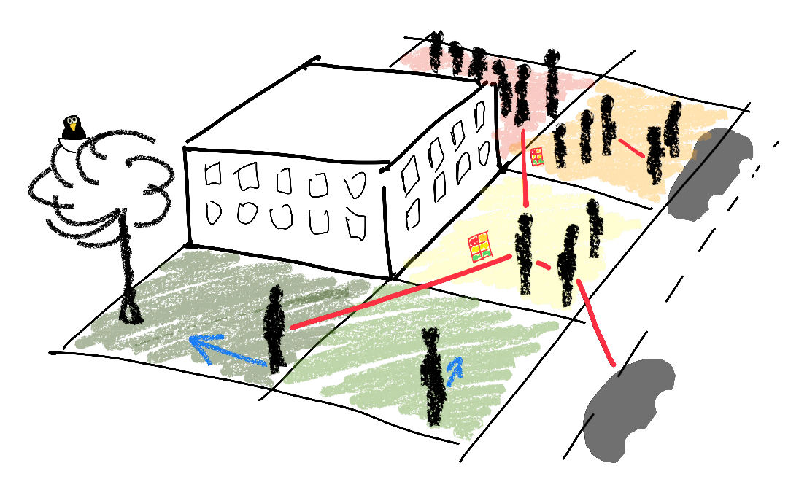
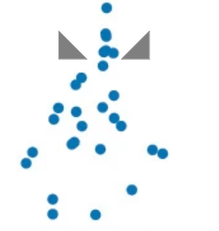
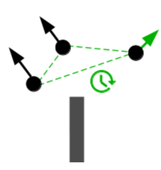
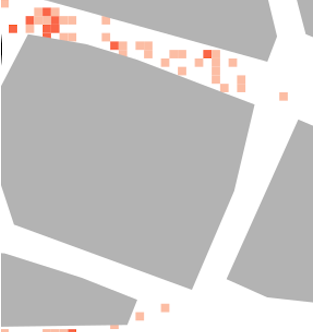
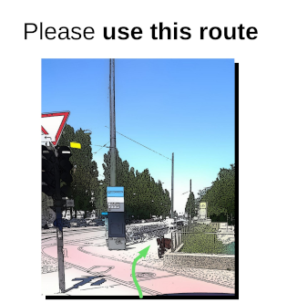

# *CrowNet*: *Crow*ds in *Net*works
CrowNet is an open source simulation framework for the development of new networked mobility concepts and intelligent transportation systems.
CrowNet has been developed as part of the [roVer research project](https://www.hm.edu/forschung/forschungsprojekte/projektdetails/wischhof/wischhof_koester_rover.de.html) at [Munich University of Applied Sciences](https://www.hm.edu/en/index.en.html) that is funded by the [Federal Ministry of Education and Research](https://www.bmbf.de/bmbf/en/home/home_node.html) (Grant number: 13FH669IX6).

### Features

CrowNet builds on state-of-the-art simulation frameworks for simulating mobile networks ([OMNeT++](https://omnetpp.org/), [INET](https://inet.omnetpp.org/), [VEINS](https://veins.car2x.org/), [Artery](http://artery.v2x-research.eu/), [Simu5G](http://simu5g.org/)) and mobility behavior ([VADERE](http://www.vadere.org/), [SUMO](https://dlr.de/ts/en/sumo/)).
CrowNet extends these frameworks with several features.

| [Detailed pedestrian mobility](doc/features/AccuratePedestrianMobility.md) | [Bi-directional interactions with pedestrian mobility](doc/features/Interactions.md) | [Sidelink based crowd monitoring](doc/features/DensityMap.md) | [App based crowd management](doc/features/RouteRecommendation.md) |
|-----------------------------------------------------------------------------|------------------------------------------------------------------------------|-------------------------------------------------------|-----------------------------------------------------------|
|                                     |                       |        |   |

### Quick start

Please see the [quick start example](doc/Installation/Installation.md) in our [documentation](doc/README.md).

### License and dependencies

Within the CrowNet simulation environment, four open-source simulation frameworks are coupled:
* [OMNeT++](https://omnetpp.org/) - The simulation framework used
  for modelling communication and information dissemination
* [VADERE](http://www.vadere.org/) - VADERE Crowd Simulation
* [SUMO](https://dlr.de/ts/en/sumo/) - Simulation of Urban Mobility
* [flowcontrol](https://github.com/roVer-HM/flowcontrol) - Simulation of crowd management strategies

The OMNeT++ simulation of communication and networking for disseminating mobility information is based on four open source simulation projects:
* [INET](https://inet.omnetpp.org/) - The INET Framework is a widely-used open-source model suite for wireless and wired networks. It includes models for all major Internet protocols.
* [Simu5G](http://simu5g.org/) - Sim5G provides a 5G and LTE/LTE-A user plane simulation model for INET and OMNeT++.
* [Artery](http://artery.v2x-research.eu/) - Artery V2X Simulation Framework
* [VEINS](https://veins.car2x.org/) - Vehicles in Network Simulation (VEINS) is an open-source vehicular network simulation framework.

Our [CrowNet features](crownet/src) are intended for academic and commercial purpose, see our [license](LICENSE).
Please check the licenses of the projects listed above for your use case and purchase licenses if necessary.

### Scientific publications

Please refer to this repository when you use CrowNet in scientific publications.
Publications in which CrowNet was used:
- S. Schuhbäck, L. Wischhof, J. Ott (2023): *Cellular Sidelink Enabled Decentralized Pedestrian Sensing*, IEEE Access. [doi: 10.1109/access.2023.3242946](https://doi.org/10.1109/access.2023.3242946)
- C. M. Mayr, A. Templeton, G. Köster (2023): *Designing mobile application messages to impact route choice: A survey and simulation study*, Plos One, 18(4), pp. 1-20. [doi: 10.1371/journal.pone.0284540](https://doi.org/10.1371/journal.pone.0284540)
- L. Wischhof, M. Kilian, S. Schuhbäck, G. Köster (2022): *On the Influence of Microscopic Mobility in Modelling Pedestrian Communication*, UNet22, Montreal, Canada, [doi: 10.1007/978-3-031-29419-8_1](https://doi.org/10.1007/978-3-031-29419-8_1)
- C. M. Mayr, G. Köster (2022): *Guiding crowds when facing limited compliance: Simulating strategies*, Plos One, 17(11), pp. 1-24. [doi: 10.1371/journal.pone.0276229](https://doi.org/10.1371/journal.pone.0276229)
- L. Wischhof, J. A. Krahl, R. Müllner (2022): *Stimuli Generation for Quality-of-Experience Evaluation of Mobile Applications*. iJIM, 16(06), pp. 113–134. [doi: 10.3991/ijim.v16i06.28691](https://doi.org/10.3991/ijim.v16i06.28691)
- M. Rupp, L. Wischhof (2022): *Prioritization for Latency Reduction in 5G MEC-Based VRU Protection Systems*, IEEE WiMob 2022, [doi: 10.1109/wimob55322.2022.9941690](https://doi.org/10.1109/wimob55322.2022.9941690)
- C. M. Mayr, S. Schuhbäck, L. Wischhof, G. Köster (2021): *Analysis of Information Dissemination through Direct Communication in a Moving Crowd*, Safety Science, Volume 142, [doi: 10.1016/j.ssci.2021.105386](https://doi.org/10.1016/j.ssci.2021.105386)
- S. Schuhbäck, L. Wischhof (2021), *Decentralized Pedestrian Density Maps based on Sidelink Communication*, IEEE International Conference on Communications COVI-COM, 14.-23. June 2021, Montreal, Canada, [doi: 10.1109/ICCWorkshops50388.2021.9473545](https://doi.org/10.1109/ICCWorkshops50388.2021.9473545)
- M. Rupp, S. Schuhbäck, L. Wischhof (2021): *Coupling Microscopic Mobility and Mobile Network Emulation for Pedestrian Communication Applications*, 8th OMNeT++ Community Summit, [arXiv:2109.12018v1](https://arxiv.org/abs/2109.12018)
- L. Wischhof, F. Schaipp, S. Schuhbäck, G. Köster (2020): *Simulation vs. Testbed: Small Scale Experimental Validation of an Open-Source LTE-A Model*, PIMRC 2020, [doi: 10.1109/pimrc48278.2020.9217163](https://doi.org/10.1109/pimrc48278.2020.9217163)
- S. Schuhbäck, N. Daßler, L. Wischhof, G. Köster (2019): *Towards a Bidirectional Coupling of Pedestrian Dynamics and Mobile Communication Simulation*, 6th OMNeT++ Community Summit, [doi: 10.29007/nnfj](https://doi.org/10.29007/nnfj)

