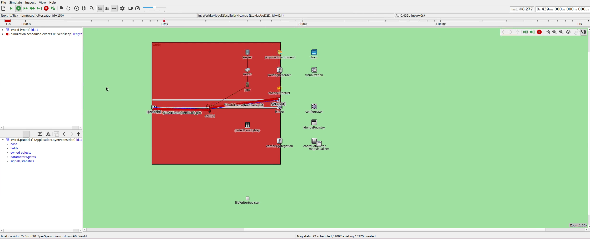

# Adaptive Density Map Simulation

This simulation scenario implements adaptive crowd density map estimation using D2D (Device-to-Device) communication in an LTE network. The simulation evaluates decentralized density map algorithms where pedestrians share locally observed density information, enabling distributed crowd monitoring without centralized infrastructure.

## Applications

The scenario models multiple applications at each node:
* **Beacon Application**: Periodic transmission of node position and status for neighbor discovery
* **Density Map Application**: Decentralized pedestrian density estimation and dissemination
* **Adaptive Rate Control**: Dynamic adjustment of transmission rates based on local network conditions

## Dependencies

The simulation uses:
- **OMNeT++ / SimuLTE**: LTE network simulation with D2D capabilities
- **Vadere**: Pedestrian dynamics simulator for realistic crowd behavior
- **SUMO**: Traffic simulator for vehicle mobility scenarios
- **BonnMotion**: Trace-based mobility for reproducible experiments
- **CrowNet density map algorithms**: Decentralized map generation and sharing

## Network Configuration

- **Network Type**: LTE D2D (Device-to-Device) in a single-cell eNB configuration
- **Channel Model**: Urban Macrocell with shadowing enabled
- **Carrier Frequency**: 2.6 GHz
- **UE/D2D TX Power**: 23 dBm
- **eNB TX Power**: 43 dBm
- **Number of Resource Blocks**: 25 (5 MHz bandwidth)

## Running the Simulation

The simulation can either be run in the OMNeT++ IDE or via command line.

### Available Configurations

#### Dynamic mobility configurations for automated study

| Configuration | Mobility Source | Description |
|--------------|-----------------|-------------|
| `final_dynamic_m_vadere` | Vadere | Uses Vadere pedestrian simulator for realistic crowd mobility |
| `final_dynamic_m_sumo` | SUMO | Uses SUMO traffic simulator for pedestrian and vehicle mobility |
| `final_dynamic_m_bonn_motion` | BonnMotion | Uses pre-recorded mobility traces from BonnMotion |

#### Ready-to-run corridor scenario configurations (with Vadere)

| Configuration | Description |
|--------------|-------------|
| `final_const_short_2x5m_d20` | Constant short scenario (2x5m, 20m depth) |
| `final_corridor_2x5m_d20` | Corridor scenario (2x5m, 20m depth) |
| `final_corridor_2x5m_d20_5perSpawn` | Corridor with 5 pedestrians per spawn |
| `final_corridor_2x5m_d20_5perSpawn_ramp_down` | Corridor with ramp-down spawning pattern |


*Corridor scenario (5 pedestrians per spawn, ramp-down) running in the OMNeT++ IDE. Pedestrian nodes (pNode) move along the corridor while exchanging D2D density map data through the LTE eNB.*

### Running in OMNeT++ IDE

1. Right-click on `omnetpp.ini`
2. Select "Run As > OMNeT++ Simulation" (or "Debug As" for debug mode)
3. Choose the desired configuration

### Running via Command Line

```bash
# Run with Vadere (starts Vadere container automatically)
python3 run_script.py vadere-opp --override-host-config --scenario-file "vadere/scenarios/corridor_2x5m_d20.scenario"
```

## Evaluating Simulation Results
 
- **Result Files:** Simulation results are stored in the `results/` folder.
- **Python Analysis Scripts:** Analysis scripts are provided in the `analysis/` folder.
- **Parameter Studies:** Parameter study configurations are in the `study/` folder.

Simulation results can be analyzed to evaluate:
- How well the distributed density map approximates actual pedestrian density
- The impact of mobility patterns on map accuracy
- Communication overhead vs. map quality trade-offs

## Trace-Based Fingerprint Tests

Some fingerprint tests in `tests/fingerprint/adaptiveMap.yml` use **BonnMotion traces**
instead of live Vadere coupling. This significantly speeds up test execution by
eliminating Docker container startup overhead and TraCI synchronization delays.

Vadere computes pedestrian movement independently, as in this simulation scenario OMNeT++ never sends commands back that would change pedestrian behavior. The density map application only
collects and shares crowd density data between nodes.

Because Vadere's output is independent of OMNeT++, running Vadere standalone produces the exact same trajectories as running it coupled.

### Generating Traces

To generate (or regenerate) BonnMotion traces for fingerprint tests:

```bash
cd crownet/simulations/adaptiveMap/study
python3 gen_fingerprint_traces.py
```

This runs Vadere standalone in a Docker container for each corridor scenario and
saves the resulting `trace.bonnMotion` files to the `trace/` directory.