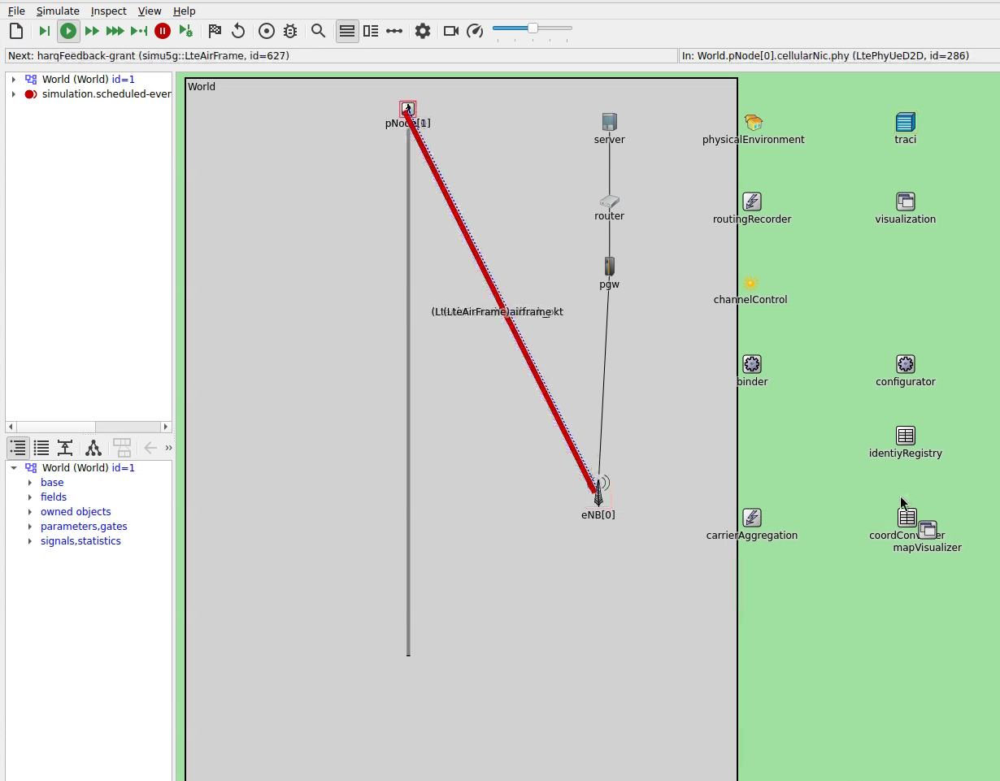
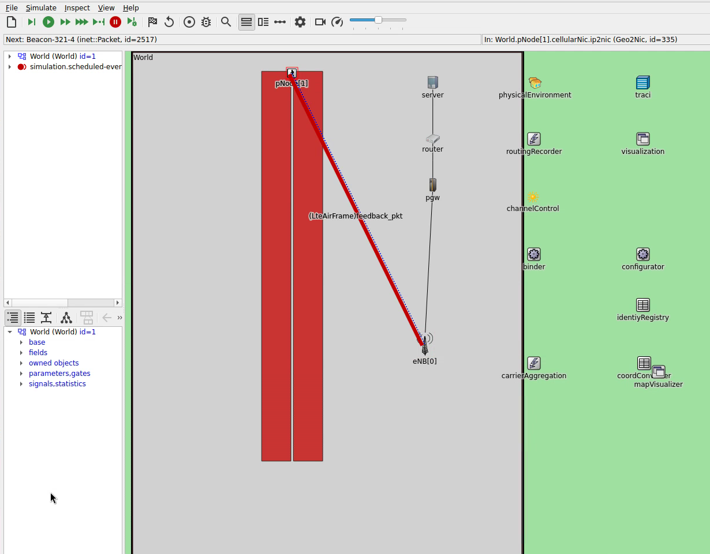
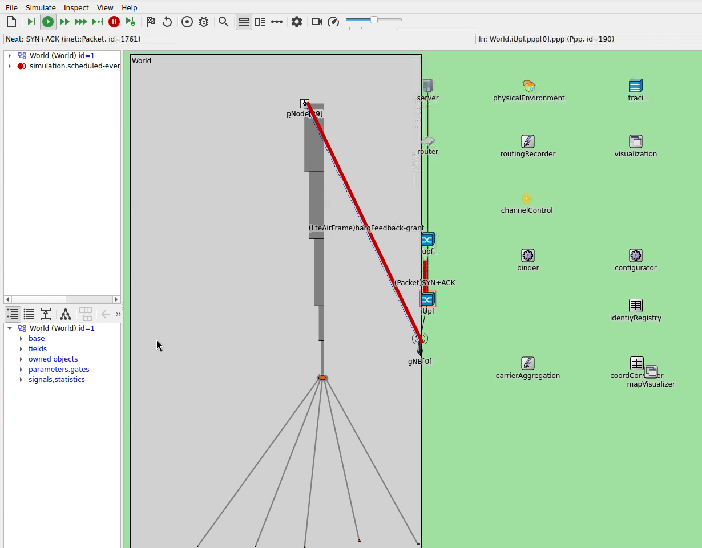
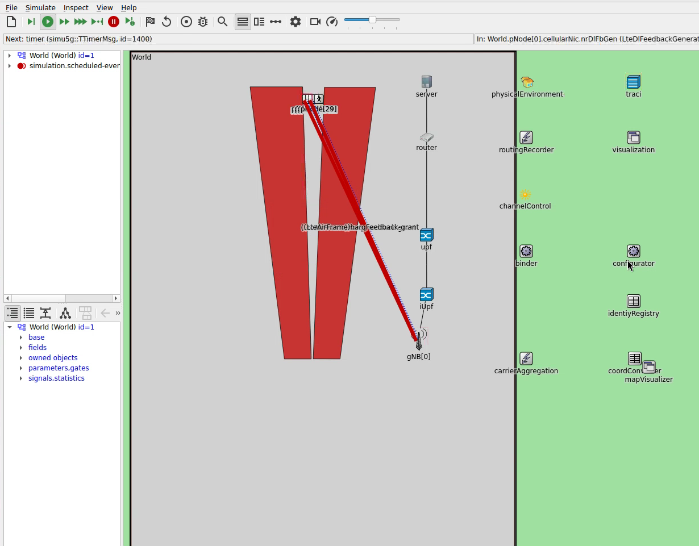

# Comparing Vadere and SUMO Pedestrian Mobility Models

The simulations evaluate how the choice of pedestrian mobility simulator affects communication performance metrics. Two mobility models are compared:
1. **Vadere**: Uses the Optimal Steps Model for pedestrian dynamics
2. **SUMO**: Uses a Cellular Automaton Stripes model for pedestrian movement

## Simulation Context

Based on established pedestrian dynamics literature [1, 2], both simulators model pedestrian movement with identical parameters to enable fair comparison:
- **Minimum speed**: 0.5 m/s
- **Maximum speed**: 2.2 m/s
- **Speed distribution**: Truncated normal with mean 1.34 m/s and stddev 0.26 m/s

## Network Configuration

The scenarios can either use 5G New Radio (NR) communication (for TCP configurations) or 4G LTE D2D (for UDP beacon configurations).

- **Network Type**: LTE D2D
- **Channel Model**: Urban Microcell with shadowing
- **Carrier Frequency**: 2.6 GHz
- **Number of Resource Blocks**: 6 (1.4 MHz bandwidth)
- **Processing Delays**: Adapted based on OpenAirInterface measurements

## Applications 

The scenario models two different types of applications at each node depending on the configuration:
* A beacon app that transmits periodic beacon messages via UDP.
* A TCP application that models HTTP traffic.

## Available Configurations

### SUMO-based Configurations

| Configuration | Description |
|--------------|-------------|
| `sumoOnly2` | Basic SUMO mobility, 2 pedestrians |
| `sumoOnly2Tcp` | Same as above with TCP transport |
| `sumoSimple` | Simple SUMO pedestrian scenario |
| `sumoSimpleTcp` | Simple scenario with TCP |
| `sumoBottleneck` | Bottleneck scenario testing congestion |
| `sumoBottleneckTcp` | Bottleneck with TCP |
| `sumoCombined` | Combined pedestrian and vehicle scenario |

### Vadere-based Configurations

| Configuration | Description |
|--------------|-------------|
| `vadereOnly2` | Basic Vadere mobility, 2 pedestrians |
| `vadereOnly2Tcp` | Same as above with TCP transport |
| `vadereSimple` | Simple Vadere pedestrian scenario |
| `vadereSimpleTcp` | Simple scenario with TCP |
| `vadereBottleneck` | Bottleneck scenario testing congestion |
| `vadereBottleneckTcp` | Bottleneck with TCP |

<table>
  <tr>
    <td align="center" width="50%"> <em>SUMO scenario: 2 pedestrians walking on a straight line</em></td>
    <td align="center" width="50%"> <em>Vadere scenario: 2 pedestrians walking on a straight line</em></td>
  </tr>
  <tr>
    <td align="center" width="50%"> <em>SUMO scenario: Pedestrians walking towards a bottleneck and afterwards spreading to different targets</em></td>
    <td align="center" width="50%"> <em>Vadere scenario: Pedestrians walking towards a bottleneck and afterwards spreading to different targets</em></td>
  </tr>
</table>

## Running the simulation

The simulation can either be run in the OMNeT++ IDE or via command line.

### Running in the OMNeT++ IDE
As with most other CrowNet++ simulations, simply do a right click on the `omnetpp.ini` file and select "Debug as > OMNeT++ Simulation" for running in debug mode or "Run as > OMNeT++ Simulation" for running in release mode.

Note that these configurations require the respective mobility simulator (Vadere or SUMO) to be running in the background.

### Running via Command Line
To run a single simulation step, use `./run_script.py`.

For running a complete parameter study and comparing multiple runs, execute `./run_study` in the simulation folder.

## Bibliography

[1] Weidmann, Ulrich (1992): *Transporttechnik der Fussgaenger*, Institut für Verkehrsplanung, Transporttechnik, Strassen- und Eisenbahnbau (IVT), ETH Zürich. [https://doi.org/10.3929/ethz-a-000687810](https://doi.org/10.3929/ethz-a-000687810)

[2] Michael J. Seitz, Nikolai W. F. Bode, Gerta Köster: *How cognitive heuristics can explain social interactions in spatial movement*. J R Soc Interface 1 August 2016; 13 (121): 20160439. [https://doi.org/10.1098/rsif.2016.0439](https://doi.org/10.1098/rsif.2016.0439)