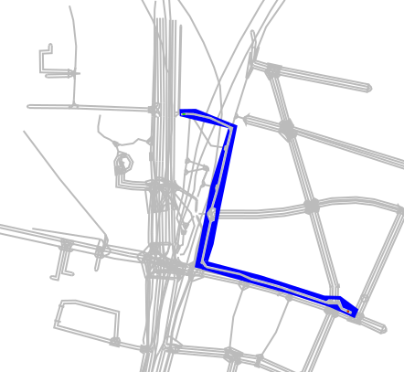

# Generation of combined Vadere- and Sumo scenarios

Some simulations scenarios require precise microscopic simulation of vehicles and pedestrians.
While SUMO is capable of both, Vadere simulates pedestrian behavior much more realistic than SUMO's striping models.
CrowNet can be coupled with Vadere and SUMO to make use of the capabilities of both simulators.
A challenge when using more than one mobility simulator is the generation of scenarios for SUMO and Vadere which use the same map data.
This directory contains a collection of python scripts that can be used for conversion between Vadere and SUMO scenarios.
SVG is used as the intermediate format.

## sumo2svg.py

Generates SVG files from SUMO network files. Useful for visualization or as a basis for the generation of Vadere scenarios.

Usage:

```bash
$ ./sumo2svg.py --net sumo.net.xml --out sumo.svg
```

## scenegen.py

Creates Vadere or SUMO scenario/netork files from SVG images

```bash
$ ./scenegen.py --svg vadere.svg --vadere vadere.scenario
$ ./scenegen.py --svg vadere.svg --sumo out.sumocfg --net out.net.xml
```

SVG elements are interpreted as follows:

- `<path [...] style="fill:#0000ff">` **or** `<rect [...] style="fill:#0000ff">`: Vadere obstacle
- All other `<path>` elements: SUMO edge
- `<rect [...] style="fill:#00ff00">` Vadere source. Target selection using `data-targets="target1,target2"`
- `<rect [...] style="fill:#ff0000">` Vadere sink

The `<svg>` element also has some attributes that are evaluated:

- `width, height, viewBox` to determaine simulation bounds
- `data-epsg` projection (e.g. UTM)
- `data-offset-x, data-offset-y` UTM offset
- `data-sumo-origbounds` Controls the SUMO `origbounds` element

Example SVG file:

```svg
<?xml version="1.0" encoding="UTF-8" standalone="no"?>
<svg
    width="493.21000000000004"
    height="662.1500000000001"
    viewBox="0 0 493.21000000000004 662.1500000000001"
    data-epsg="+proj=utm +zone=32 +ellps=WGS84 +datum=WGS84 +units=m +no_defs"
    data-offset-x="-691444.68"
    data-offset-y="-5335504.47"
    data-sumo-origbounds="11.548225,48.117927,11.594341,48.171410"
    version="1.1"
    id="svg5"
    xmlns="http://www.w3.org/2000/svg"
    xmlns:svg="http://www.w3.org/2000/svg">

    <g>
        <rect
            style="fill:#ff0000;fill-rule:evenodd;stroke-width:0.653884"
            id="2000"
            width="2.8519194"
            height="1.7979492"
            x="232.74142"
            y="197.92943" />
        <path
            style="fill:#0000ff;fill-rule:evenodd"
            d="m 255.5931,358.84587 3.96788,6.07583 36.70297,8.05977 12.02766,4.95986 30.13115,8.30777 18.22748,6.07582 33.23106,11.15969 2.97592,-2.10794 11.03569,0.49598 0.74397,0.124 3.34791,8.55576 10.16771,4.33988 -0.86797,2.97591 -11.28368,-4.95986 -3.7199,-5.70383 -9.79572,-0.124 -37.32295,-12.27566 -15.99555,-5.45584 -12.64764,-3.7199 -19.09546,-4.95986 -11.53167,-5.33185 -36.82696,-7.93577 -2.85192,-1.85995 -1.61196,-3.09991 -0.86797,6.32382 97.70924,27.40323 42.65479,14.0116 27.03124,11.90366 4.09188,-9.54773 -19.83944,-14.63158 -17.4835,-0.49599 -68.81806,-21.94738 z"
            id="1000"/>
        <path
            style="fill:#0000ff;fill-rule:evenodd"
            d="m 255.68078,358.84586 4.95986,-23.55933 4.09188,-18.47548 3.09991,-1.23997 1.48796,-13.51561 -2.97592,-1.23997 6.32383,-21.2034 2.10794,-8.92775 7.0678,-30.99912 6.57181,-26.41126 -4.58787,-1.85994 1.23997,-2.97592 7.68778,2.85192 -18.35148,89.40147 -7.68779,40.42286 -6.07582,19.09546 z"
            id="1001" />
        <path
            style="fill:#0000ff;fill-rule:evenodd"
            d="m 254.6888,363.80572 -2.5466,-1.84586 0.74527,-2.21389 4.77725,-22.4755 4.46387,-21.2034 -2.72792,-7.0678 v -2.10794 l 4.46387,-6.57182 4.95986,-17.11151 -0.61998,-3.5959 1.11597,-3.5959 1.73595,-0.61998 8.05977,-36.08298 -1.36396,-1.73595 0.86798,-3.96789 1.98394,-0.86798 3.96789,-15.12757 -1.73595,-3.5959 -19.59145,63.8582 -10.04371,52.57451 -7.1918,36.08298 8.18377,1.85995 z"
            id="1002" />
        <path
            style="fill:#0000ff;fill-rule:evenodd"
            d="m 283.90384,211.43734 -12.45039,-5.69912 -7.89109,-3.72635 -19.55236,-4.42778 -6.79511,-0.21919 -6.22519,0.65759 0.35072,2.27965 6.18135,-0.61376 8.19796,0.61376 12.75726,2.89339 3.98939,0.96447 20.51683,9.46931 -0.2192,0.52607 -53.08949,-13.06414 -0.26304,-7.71573 17.84263,-0.26303 37.87723,15.34378 z"
            id="1003" />
        <rect
            style="fill:#00ff00;fill-rule:evenodd"
            id="3000"
            data-targets="2000"
            width="2.1919692"
            height="2.060451"
            x="412.70395"
            y="413.62457" />

        <rect
            style="fill:#ff0000;fill-rule:evenodd;stroke-width:0.653884"
            id="2001"
            width="2.1919692"
            height="2.060451"
            x="412.70395"
            y="413.62457" />

        <rect
            style="fill:#00ff00;fill-rule:evenodd"
            id="3001"
            data-targets="2001"
            width="2.8519194"
            height="1.7979492"
            x="232.74142"
            y="197.92943" />
    </g>
</svg>
```

## Scenario generation from OSM SUMO

1) Generate SVG from SUMO net: `./sumo2svg.py --net mf_base.net.xml --out sumo.svg`
2) Edit `sumo.svg` and add obstacles/sources/sinks using the above rules. Inkscape is a good SVG editor. Tags might be edited by hand afterwards. Save as `vadere.svg`
3) Genreate vadere scenario from `vadere.svg`: `../scenegen.py --svg vadere.svg --vadere vadere.scenario`

### vadere.svg

