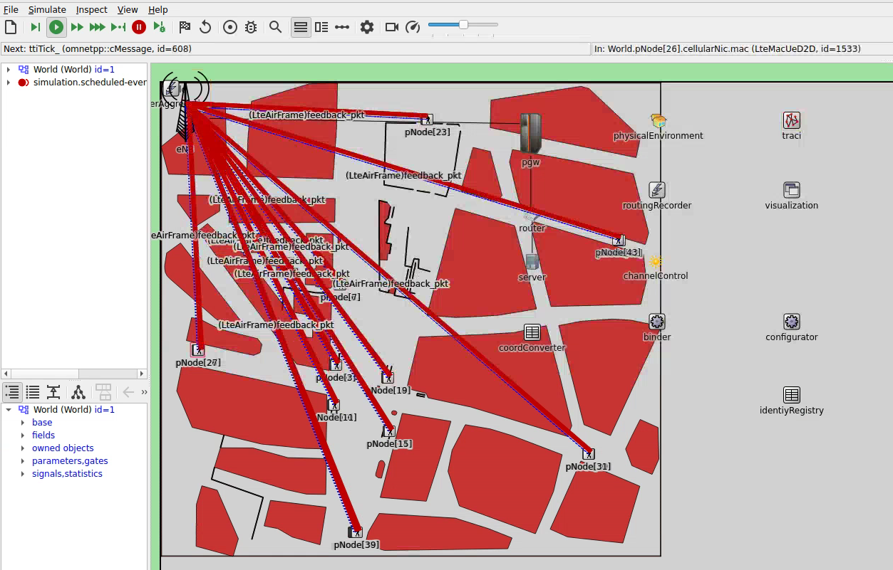
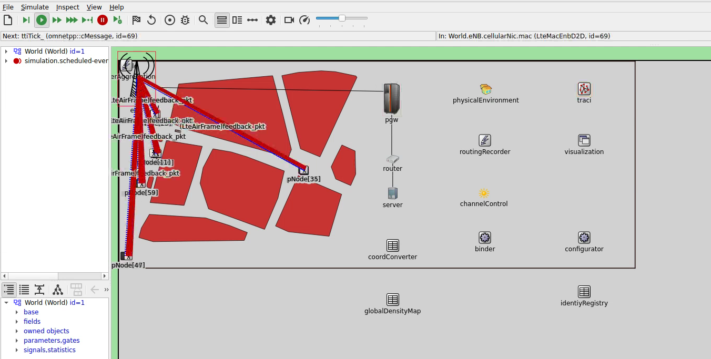

# CoviCom21 - Crowd Density Communication Simulation

The CoviCom21 simulations model pedestrians exchanging crowd density information via LTE D2D communication. The goal is to evaluate:
- How pedestrians can collaboratively build and share density maps
- Communication performance in realistic urban pedestrian scenarios
- The effectiveness of different map aggregation strategies

## Simulation Context

The scenario models the München Freiheit subway station area in Munich, with:
- Pedestrian mobility provided by Vadere simulator
- LTE D2D communication for peer-to-peer data exchange
- Decentralized density map application running on each mobile device

## Applications

Each pedestrian node runs:
1. **DensityMapApp**: Collects and distributes crowd density observations
2. **BeaconApp**: Periodic beacon messages for neighbor discovery

## Network Configuration

The scenario simulates 4G LTE D2D Sidelink communication natively.

- **Network Type**: LTE D2D
- **Channel Model**: Urban Microcell
- **Carrier Frequency**: 2.6 GHz
- **Number of Resource Blocks**: 25 (5 MHz bandwidth)
- **TX Power**: 20 dBm

## Available Configurations

| Configuration | Description |
|--------------|-------------|
| `AidSetup` | Base configuration with AID (Awareness and Information Distribution) applications |
| `env_mf_001_small_60` | Small München Freiheit scenario, 60s simulation |
| `env_mf_001_small_120` | Small München Freiheit scenario, 120s simulation |
| `env_mf_001_base_96` | Base scenario with 96 pedestrians |
| `env_mf_001_base_72` | Base scenario with 72 pedestrians |
| `vadere_120` | Vadere mobility, 120s duration |
| `vadere_60` | Vadere mobility, 60s duration |
| `vadere_base_96` | Vadere with 96 pedestrians |
| `vadere_base_72` | Vadere with 72 pedestrians |
| `vadere_120_maptypes` | Test different map aggregation types |

<table>
  <tr>
    <td align="center" width="90%"><br/><em>Base scenario with 96 pedestrians</em></td>
  </tr>
  <tr>
    <td align="center" width="90%"><br/><em>Vadere mobility to test different map aggregation strategies</em></td>
  </tr>
</table>

## Running the simulation

The simulation can either be run in the OMNeT++ IDE or via command line.

### Running in the OMNeT++ IDE
As with most other CrowNet simulations, simply right click on the `omnetpp.ini` file and select "Debug as > OMNeT++ Simulation" for running in debug mode or "Run as > OMNeT++ Simulation" for running in release mode.

### Running via Command Line
A small script is provided: simply execute `./run -u Cmdenv -c [ConfigName]` in the simulation folder.

```bash
# Run base configuration
./run -u Cmdenv -c AidSetup

# Run specific environment configuration
./run -u Cmdenv -c vadere_120
```

### Evaluating Simulation Results
In order to evaluate the simulation results, two steps need to be performed:

* The `.vec` simulation trace files need to be converted to `.csv` format, so they can be read by the Python analysis script.
* The Python analysis script `analysis.py` is called to calculate the results and create corresponding graphs.