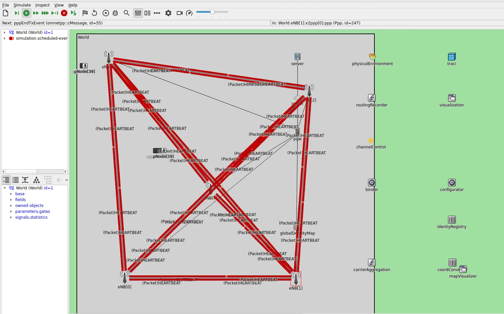

# Muenchner Freiheit LTE Simulation

This simulation folder contains LTE-based pedestrian communication scenarios for the Muenchner Freiheit subway station area in Munich, Germany.

1. Pedestrian-to-pedestrian D2D communication
2. Crowd density map distribution in single-cell and multi-cell deployments
3. Evaluation of LTE network performance under various pedestrian loads

## Network Configuration

- **Network Type**: LTE D2D
- **Channel Model**: Urban Microcell
- **Carrier Frequency**: 2.6 GHz
- **Number of Resource Blocks**: 25
- **TX Power**: 20 dBm (UE, D2D, eNodeB)

## Applications

Pedestrian nodes run beacon and density map applications:
1. **Beacon**: Broadcasts position beacons to maintain a neighborhood table
2. **Density Map**: Provides decentralized pedestrian density maps

Some configs add entropy-based maps or alert sender/receiver applications depending on the scenario.

## Available Simulation Configurations

### `omnetpp.ini`

| Configuration | Description |
|---|---|
| `vadere00_120` | Vadere, small area, 120 pedestrians |
| `vadere_base_44` | Vadere, base area, 44 pedestrians |
| `vadere_base_72` | Vadere, base area, 72 pedestrians |
| `vadere_base_96` | Vadere, base area, 96 pedestrians |
| `vadere_base_44_entropy` | Vadere, 44 pedestrians, entropy-based density map |
| `vadere_multiCellsSubwayStation` | Vadere, 5-cell multi-eNB, 96 pedestrians |
| `mucSumo_1` | SUMO, 6-cell, 2 pedestrians |
| `mucSumo_2` | SUMO, 6-cell, 60 pedestrians |
| `mucSumo_base` | SUMO, 5-cell, 300 pedestrian |
| `subwayStationary_centerEnb` | Stationary nodes, single center eNB |
| `subwayStationary_lowerEnb` | Stationary nodes, single lower eNB |
| `subwayStationary_multiEnb` | Stationary nodes, 5-cell multi-eNB |
| `subwayStationary_multiEnb_entropy` | Stationary nodes, 5-cell, entropy map |
| `subwayDynamic_multiEnb_compact_density` | Vadere, 5-cell, dynamic pedestrians |

### `omnetpp_ymfd4s.ini`

| Configuration | Description |
|---|---|
| `final_mf_004` | Scenario `mf_004_template` |
| `final_mf_005` | Scenario `mf_005_template` |
| `final_mf_005_2` | Scenario `mf_005-2_template` |
| `final_mf_006` | Scenario `mf_006_template` |
| `final` | Scenario `mf_005_template` with YMF+DistStep algorithm |

### `omnetpp_ymfd4s_onePacket.ini`

Contains additional YMF algorithm variants.


*YMF+Dist `final` config in the OMNeT++ IDE: 5-cell multi-eNB deployment with pedestrian nodes exchanging D2D HEARTBEAT packets.*

## Running the Simulation

This simulation supports both Vadere and SUMO mobility providers.

### Running via Command Line

```bash
# Vadere-based scenario
python3 run_script.py vadere-opp --create-vadere-container --opp.-c vadere00_120

# SUMO-based scenario
python3 run_script.py sumo-opp --create-sumo-container --opp.-c mucSumo_base

# Using a specific ini file
python3 run_script.py vadere-opp --create-vadere-container --opp.-f omnetpp_ymfd4s.ini --opp.-c final
```

### Running in the OMNeT++ IDE

As with most other CrowNet++ simulations, right click on the `omnetpp.ini` file and select "Debug as > OMNeT++ Simulation" for running in debug mode or "Run as > OMNeT++ Simulation" for running in release mode.