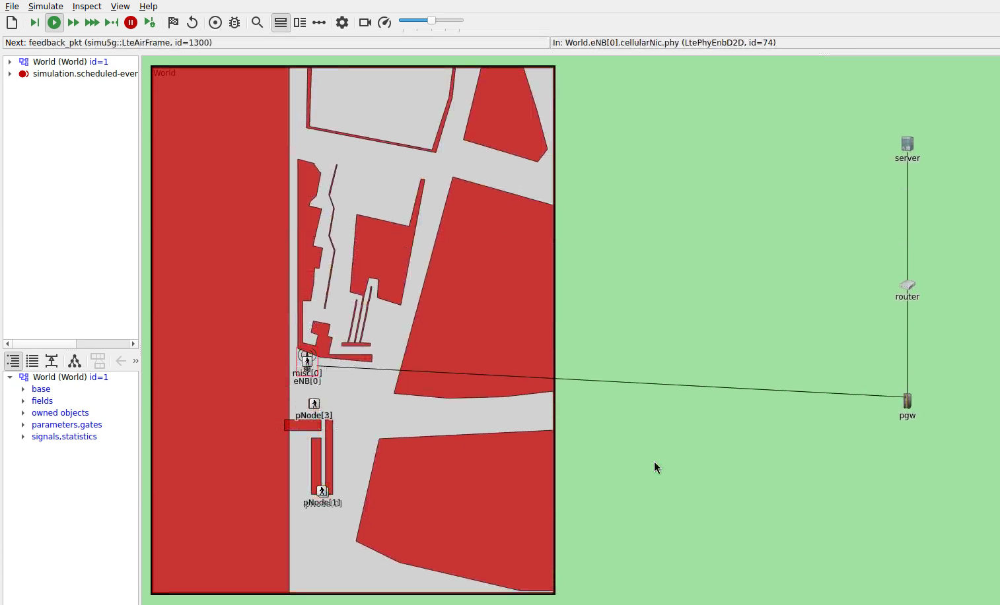

# Muenchner Freiheit Route Choice Application

This simulatio implements a navigation guidance application for pedestrians in the Muenchner Freiheit area using cellular communication.

1. Pedestrians receive navigation guidance via cellular network
2. Route recommendations are updated in real-time based on crowd conditions
3. Flow control algorithms can influence pedestrian routing

## Network Configuration

- **Network Type**: LTE D2D
- **Channel Model**: Urban Microcell with fading enabled
- **Carrier Frequency**: 2.6 GHz
- **Number of Resource Blocks**: 25
- **TX Power**: 20 dBm (UE, D2D, eNodeB)

## Applications

### Pedestrians
1. **Route Information**: Receives route recommendations via multicast
2. **Density Map**: Contributes to a decentralized density map
3. **Beacon**: Broadcasts position/status beacons to maintain a neighborhood table

### Relay Node
A stationary relay node is placed at the eNB position and runs:
1. **Route Control**: Sends rerouting recommendations to pedestrians
2. **Density Map**: Collects density information
3. **Beacon**: Beacon app with a very long generation interval

### Flow Control Integration

The `control.py` script implements the `AvoidShort` controller, which:
- Reads density maps from the relay node's density map application
- Measures density in 3 measurement areas of the scenario
- Recommends an alternative route when the short route is congested
- Sends route recommendations via the relay node

## Available Simulation Configurations

| Configuration | Description |
|--------------|-------------|
| `final` | Main navigation guidance application configuration |
| `test` | Short test configuration |


*Muenchner Freiheit route choice application scenario running in the OMNeT++ IDE.*

## Running the Simulation

This simulation requires the Vadere pedestrian simulator and optionally the flow controller, both provided as Docker containers.

### Running via Command Line

```bash
# Full simulation with flow control
python3 run_script.py vadere-opp-control --write-container-log --create-vadere-container \
  --override-host-config --experiment-label output --with-control control.py \
  --ctrl.controller-type AvoidShort --opp.-c final

# Short test run
python3 run_script.py vadere-opp-control --write-container-log --create-vadere-container \
  --override-host-config --experiment-label output --with-control control.py \
  --ctrl.controller-type AvoidShort --opp.-c test
```

### Running in the OMNeT++ IDE

Both configs (`final`, `test`) require the Vadere container and flow controller to be running externally.

1. **Terminal 1** — Start the OMNeT++ IDE:
   ```bash
   omnetpp-ide
   ```
2. **Terminal 2** — Start the FlowControl IDE (PyCharm):
   ```bash
   flowcontrol-ide
   ```
3. **Terminal 3** — Start the Vadere mobility container:
   ```bash
   vadere
   ```

4. **In PyCharm**:
   - Open `crownet/simulations/mucFreiheit_route_choice_app/control.py`
   - Set up a Run Configuration: **Run** → **Edit Configurations** → **+** → **Python**
     - **Script path**: `control.py`
     - **Working directory**: `crownet/simulations/mucFreiheit_route_choice_app`
   - Run the configuration. The controller starts listening for connections.

5. **In the OMNeT++ IDE**:
   - Right-click `omnetpp.ini` → **Run As** → **OMNeT++ Simulation**
   - Select `final` or `test` from the config dropdown
