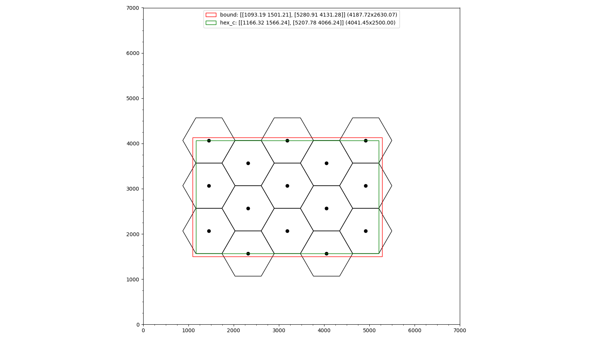

# Multi-eNB Large-Scale D2D Density Map Simulation

This simulation models decentralized pedestrian density estimation using D2D communication across a multi-cell LTE deployment covering a ~5km × 3km urban area in Munich. Pedestrian mobility is replayed from pre-generated SUMO/BonnMotion traces.

## Applications

Each node runs three applications:

* **Beacon**: Broadcasts periodic presence beacons. Required for each node to discover and track the number of neighbors in its local resource sharing domain.
* **Density Map**: Distributes decentralized pedestrian density map data using the YMF+DistStep algorithm.
* **Entropy Map**: Distributes random geospatial measurement data.

## Running the Simulation

### Prerequisites

* Pre-generated BonnMotion traces from SUMO
* No external mobility simulator container required at runtime

### Running via Command Line

This simulation is designed to run via `run_script.py` which handles both simulation execution and post-processing:

```bash
python3 run_script.py
```

For parameter studies, use the study script:

```bash
cd study
python3 s2_ttl_and_stream.py
```

The study script uses CrowNet's `suqc` framework to run parameterized simulation campaigns with multiple seeds and variations.

### Evaluating Simulation Results

The `run_script.py` contains an extensive post-processing pipeline that is executed automatically after simulation completion. Analysis scripts in `analysis/` provide additional evaluation tools for multi-seed aggregation.

## Network Configuration

### Common Parameters
- **Channel Model**: Urban Macrocell
- **TX Power**: UE 23 dBm, eNB 43 dBm
- **Number of Resource Blocks**: 25
- **Carrier Frequency**: 2.6 GHz
- **D2D Mode**: Preconfigured TX params with CQI 7

### Cell Deployment Options

The active deployment (included in `omnetpp.ini`) is the 500m-radius hex grid.


*5×3 hexagonal eNB grid layout (500m radius). Black dots: 15 base station positions. Red box: simulation boundary (~4.2km × 2.6km). Green box: hex coverage area.*


## Available Configurations

### Runnable Configurations

| Configuration | Extends | Description |
|---|---|---|
| `final_multi_enb` | topo + network + noTraCI + maps + nodes | Main multi-eNB configuration |
| `final_multi_enb_dev` | final_multi_enb | Development variant 
| `final_multi_enb_30_min` | final_multi_enb | Extended 30-minute simulation |