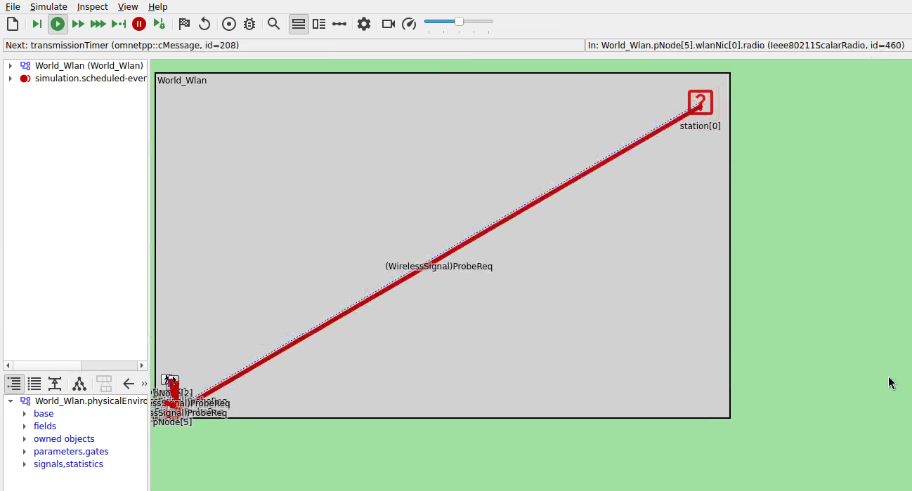

# Separation of Slow and Fast Pedestrians

This simulation contains WLAN-based scenarios for testing pedestrian separation based on walking speed differences. The separation simulation evaluates:
1. Detection of fast vs. slow pedestrian groups
2. WLAN-based communication for speed-based separation guidance
3. Detour messaging to redirect pedestrians to appropriate paths

##  Vadere Scenario Details

- **Topography**: 100m × 60m
- **Simulation Time**: 500s
- **Source 1** (fast): `speedDistributionMean = 1.8`, spawns 3 pedestrians per event
- **Source 2** (slow): `speedDistributionMean = 0.9`, spawns 3 pedestrians per event
- **Target**: Single absorbing target
- **Coordinate System**: EPSG:32632 (UTM Zone 32U)

## Network Configuration

- **Network Type**: IEEE 802.11 WLAN
- **Path Loss Model**: Log-normal shadowing
- **Obstacle Loss**: Ideal obstacle loss model
- **Multicast Group**: 224.0.0.10 for broadcast messages

## Applications

### Stationary Access Point
- Runs `UdpDetourApp` to broadcast detour information
- Announces entrance closures and alternative routes

### Pedestrian Nodes
- Run `UdpDetourAppVadere` to receive detour messages
- Notify Vadere mobility provider of route changes
- Use WLAN multicast for message reception

## Available Configurations

| Configuration | Description |
|--------------|-------------|
| `basic` | Base configuration with stationary access point |
| `vadere-01` | Vadere-based pedestrian separation scenario with detour application |

   
  <em>Basic configuration running in the OMNeT++ IDE: station[0] and pedestrian nodes exchanging WLAN probe requests in the World_Wlan network</em>

## Running the Simulation

The simulation can either be run in the OMNeT++ IDE or via command line.

### Running in the OMNeT++ IDE
As with most other CrowNet++ simulations, right click on the `omnetpp.ini` file and select "Debug as > OMNeT++ Simulation" for running in debug mode or "Run as > OMNeT++ Simulation" for running in release mode.

Note: The `vadere-01` configuration requires a running Vadere server. The `basic` configuration can be run standalone in the IDE.

### Running via Command Line
Execute `./startsim.sh` in the simulation folder. This script runs the `vadere-01` configuration using `opp_runall`.