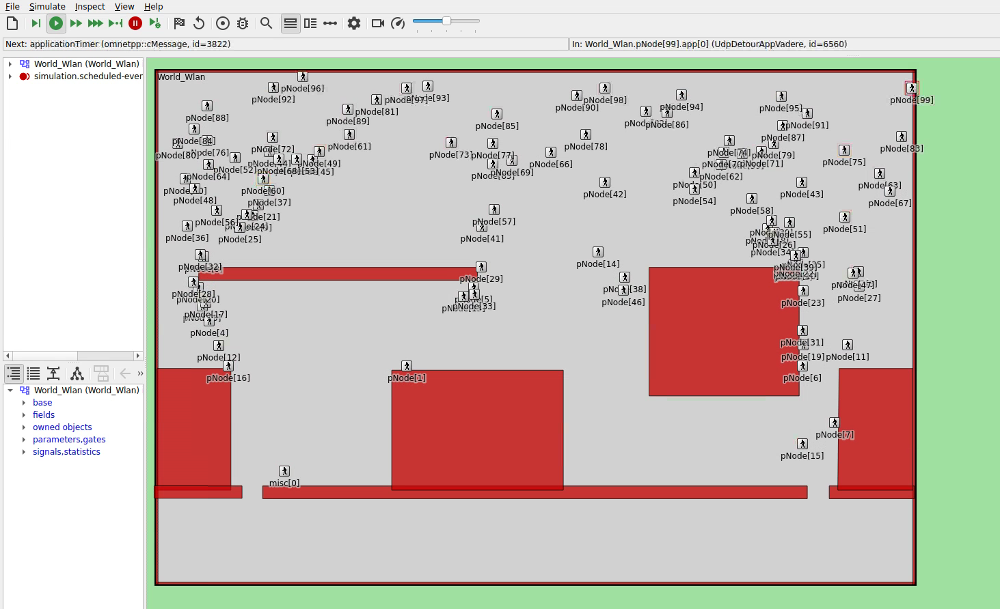

# Simple Detour Scenario

This simulation folder contains WLAN-based pedestrian detour scenarios designed for sensitivity and uncertainty quantification studies.

## Simulation Context

The scenario models pedestrians who:
- Walk through an area with potential obstructions and multiple target exits
- Receive detour messages via WLAN multicast
- Adjust their routes based on received guidance

### Vadere Scenario Details

- **Topography**: 177m × 120m
- **4 Sources**: Spawn 1 pedestrian every 2s each
- **3 Targets**: 2001 (absorber, final exit), 2002 (entrance, closed by detour), 2003 (alternative route)
- **1 Target Changer**: Redirects pedestrians entering the area near target 2002 to route 2003 → 2001
- **2 Measurement Areas**: Area 10 (redirection zone, upper part) and Area 20 (entire topography)
- **Coordinate System**: EPSG:32632 (UTM Zone 32U)

## Available Configurations

| Configuration | Description |
|--------------|-------------|
| `basic` | Base WLAN configuration with stationary misc node |
| `dimensional` | Dimensional radio settings (extends for radio parameter analysis) |
| `vadereBasic` | Extends `basic` with Vadere mobility and detour applications |
| `final` | Extends `vadereBasic` + `dimensional`, production configuration for studies |

<p align="center">
  <br/>
  <em>Final configuration running in the OMNeT++ IDE: pedestrian nodes (pNode) navigating the detour scenario with misc[0] broadcasting in the World_Wlan network</em>
</p>

## Running the Simulation

The simulation can either be run in the OMNeT++ IDE or via command line.

### Running in the OMNeT++ IDE
As with most other CrowNet++ simulations, right click on the `omnetpp.ini` file and select "Debug as > OMNeT++ Simulation" for running in debug mode or "Run as > OMNeT++ Simulation" for running in release mode.

Note: Only the `basic` configuration can be run standalone in the IDE. The `vadereBasic` and `final` configurations require a running Vadere server.

### Running via Command Line
For CrowNet++ container-based runs, use `run_script.py`:
```bash
python3 run_script.py vadere-opp --create-vadere-container --override-host-config --opp.-c final
```

## Post-Processing

The `run_script.py` performs automated post-processing after simulation completion:

| QoI | Description |
|-----|-------------|
| `degree_informed_extract.txt` | Percentage of informed pedestrians over time |
| `time_95_informed_redirection_area.txt` | Time to reach 95% informed in redirection area |
| `time_95_informed_all.txt` | Time to reach 95% informed overall |
| `poisson_parameter.txt` | Mean Poisson parameter from pedestrian generation |
| `packet_age.txt` | Statistics on received packet lifetime |
| `number_of_peds.txt` | Descriptive statistics of pedestrians in simulation |