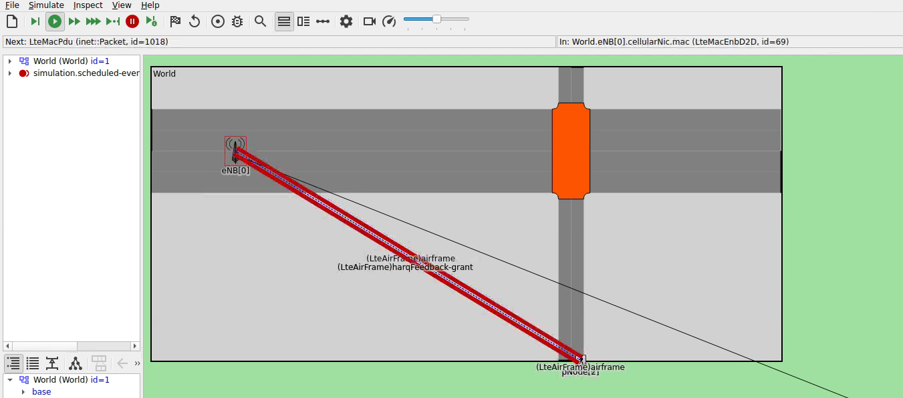
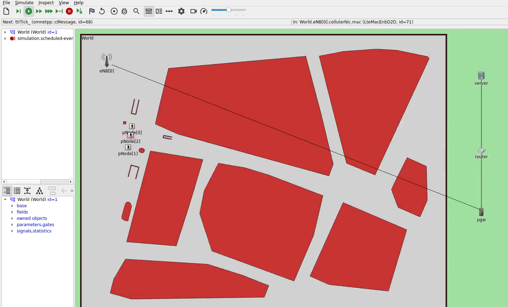

# Simulations for Testing CrowNet
This folder contains several simulations which test different functionalities of CrowNet.
The main purpose is to verify the correct behaviour of the models - therefore, these
simulations are also run as part of our daily continuous integration pipeline (CI pipeline).


*SUMO-based crossing simulation with pedestrians and LTE communication in the OMNeT++ IDE*


*BonnMotion-based simulation with pedestrian nodes in an urban environment, connected via LTE to a server*

## Manually Running the Simulations in this Folder

If you want to test the simulations in this folder manually or via the OMNeT++ IDE, 
be aware that you need to launch the required CrowNet containers beforehand:
* Before running simulations using *sumo* as mobility simulator, you need to launch the sumo container. 
  This can be done by running the `sumo` script in the `crownet/scripts` folder.
  
* Before running simulations using *vadere* as mobility simulator, you need to launch the vadere container. 
  This can be done by running the `vadere` script in the `crownet/scripts` folder.

* Additionally, if you want to test the CrowNet pedestrian flow control features, you *additionaly* need to launch the flowcontrol container beforehand. This can be done by running the `control` script in the `crownet/scripts` folder. It requires the specification of the control script to be used. For example, if you want to control the simulation with the `control_1.py` script in this folder, 
you can launch the required control container with:
```
user@simpc:~/crownet/crownet/simulations/testSim$ control exec /init_dev.sh control_1.py
```

