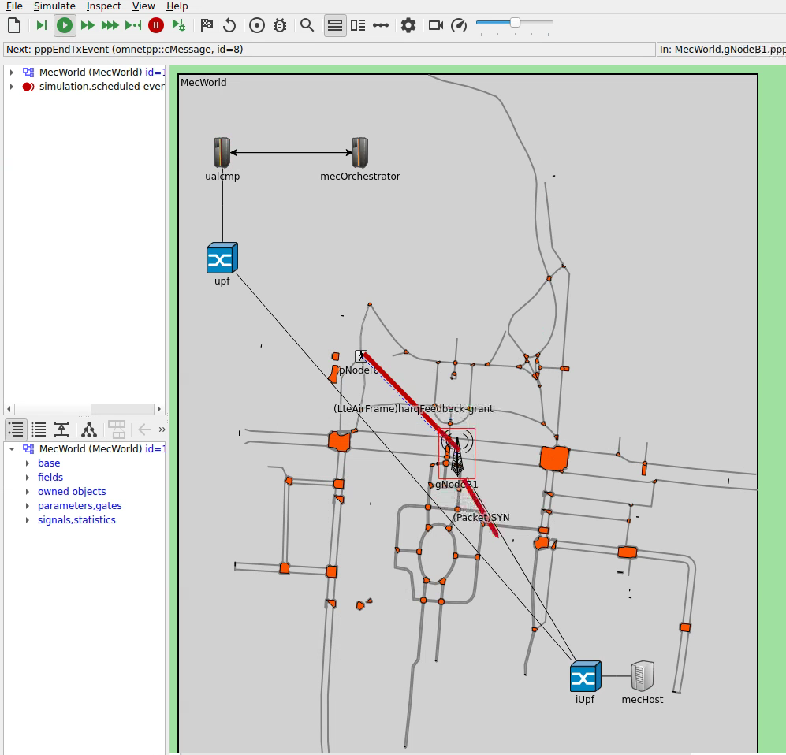
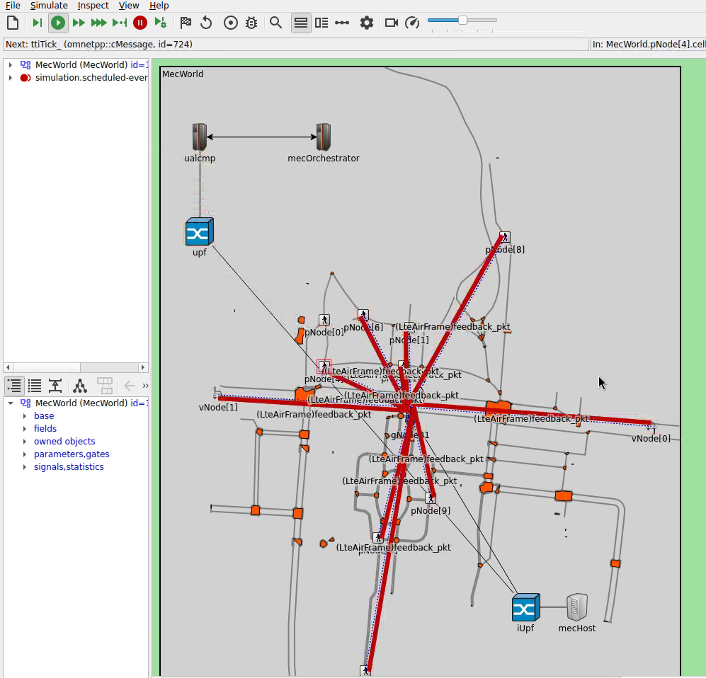

# Vulnerable Road User (VRU) Protection using MEC

The simulations in this folder model a prioritization scheme for VRU protection systems using Multi-access Edge Computing (MEC). Nodes (pedestrians and vehicles) send beacons to a MEC server via 5G NR, which aggregates and prioritizes the beacon data before disseminating it back to the nodes.

Please refer to the following publication for the details:

Matthias Rupp, Lars Wischhof, "Prioritization for Latency Reduction in 5G MEC-Based VRU Protection Systems", 18th International Conference on Wireless and Mobile Computing, Networking and Communications (IEEE WiMob 2022), Oct. 2022.

Note: In order to exactly reproduce the simulation results within the paper, use the code on branch https://github.com/roVer-HM/crownet/tree/en4ppdr_wimob22

---

*thessaloniki_prio scenario showing the MecWorld network with Luitpoldpark map, gNodeB1, mecHost, and MEC infrastructure*

*thessaloniki_v2pp2v scenario with pedestrian and vehicle nodes exchanging feedback packets via gNodeB1*

---

## Network Architecture

This simulation uses a custom network defined in `MECWorld.ned`. It includes:
- **gNodeB1**: 5G NR base station
- **mecHost**: MEC host running the `MECBeaconApp` for beacon aggregation
- **upf / iUpf**: User Plane Function nodes
- **ualcmp**: UE Application Lifecycle Management Proxy
- **mecOrchestrator**: MEC orchestrator for app management

Communication uses **5G NR**, configured with NR channel models and NR NIC types.

## Available Configurations

| Configuration | Extends | Description |
|---|---|---|
| `MEC_D2D` | — | Base config: MEC + D2D with UEBeaconApp (cannot be run directly) |
| `MEC_D2D_singleapp` | — | Base config: MEC + D2D with UEMECApp (cannot be run directly) |
| `LuitpoldparkMEC_SimpleVRU` | `MEC_D2D_singleapp` | Base config for Luitpoldpark scenario (cannot be run directly) |
| `LuitpoldparkMEC_SimpleVRU_prio` | `LuitpoldparkMEC_SimpleVRU` | Luitpoldpark with prioritization, beacon freq 5 Hz, 100s |
| `LuitpoldparkMEC_SimpleVRU_prio_reduced` | `LuitpoldparkMEC_SimpleVRU` | Luitpoldpark with prioritization, beacon freq 2 Hz, 200s |
| `LuitpoldparkMEC_SimpleVRU_large` | `LuitpoldparkMEC_SimpleVRU` | Luitpoldpark large scenario, beacon freq 2 Hz, 300s |
| `thessaloniki22` | `LuitpoldparkMEC_SimpleVRU` | WiMob2022: default aggregation, 200s |
| `thessaloniki_v2pp2v` | `thessaloniki22` | WiMob2022: v2p aggregation |
| `thessaloniki_prio` | `thessaloniki22` | WiMob2022: prio aggregation (4 groups) |
| `thessaloniki_prio_lgarea` | `thessaloniki_prio` | WiMob2022: prio aggregation (6 groups) |
| `thessaloniki_prio_singlearea` | `thessaloniki_prio` | WiMob2022: prio aggregation (1 group) |
| `thessaloniki_D2D` | `thessaloniki22` | WiMob2022: D2D only (no MEC beacons) |

## MEC Aggregation Strategies

The MEC beacon aggregation supports different strategies, configured via `*.mecHost.MECBeaconApp*.aggregationStrategy`:

| Strategy | Description |
|---|---|
| `default` | Standard beacon aggregation |
| `v2p` | Vehicle-to-pedestrian prioritized aggregation |
| `prio` | Priority-based aggregation with configurable groups and sizes |
| `dz` | Danger zone-based aggregation |

## Running the Simulation in the OMNeT++ IDE

As with most other CrowNet simulations, right click on the `omnetpp.ini` file and select "Debug as > OMNeT++ Simulation" for running in debug mode or "Run as > OMNeT++ Simulation" for running in release mode. Then select one of the runnable configurations.