# Simulation-Result-Based Tests

This suite extends fingerprint testing by validating behavioral stability against
numeric baselines rather than strict byte-identical output.

## Objective

Result comparison tests examine whether the simulated behavior has changed beyond
accepted bounds:

1. Run the configured simulation command for each test case.
2. Locate the newest `.vec` and `.sca` result files.
3. Extract representative vector and scalar metrics.
4. Aggregate across matched modules.
5. Compare current output to baseline CSV files.
6. Evaluate thresholds and report failures.
7. Generate diagnostic plots for vector metrics.

Failure criteria:

- Scalar metric fails if `|baseline - current| > abs_threshold`.
- Vector metric fails if either:
  - `rmse_delta > rmse_threshold`, or
  - `max_abs_delta > max_abs_threshold`.

Thresholds are maintained per selector and currently set to the default values:

- scalar relative ratio: `0.01`
- vector max-abs relative ratio: `0.005`
- vector RMSE relative ratio: `0.004`

Vector RMSE suggestions should be capped by the corresponding max-abs
thresholds to avoid contradictory acceptance criteria.

## How to run

`result_compare_test` auto-discovers all `*.yml` files in this directory. Each YAML file defines one or more independent test cases.

Run all test cases:

```bash
./result_compare_test
```

Run selected YAML files:

```bash
./result_compare_test --config-file openair.yml --config-file mucFreiheit.yml
```

Run selected cases:

```bash
./result_compare_test --case openair_s4 --case simple_detour_wlan
```

Regenerate all baselines:

```bash
./generate_baselines
```

Regenerate baselines for selected cases:

```bash
./generate_baselines --case vadere_corridor_ramp_down --case covicom21_vadere_60
```

Update baseline from a currently accepted behavior change:

```bash
./result_compare_test --update-baseline --case <case_name>
```

## Baseline and artifact layout

Baselines are versioned under `baselines/<case_name>/`.

- Vector baseline format: `vector_<metric_id>.csv` with `time,value`.
- Scalar baseline format: `scalar_<metric_id>.csv` with `value`.

Comparison artifacts are written to `output/` and include:

- case-level summaries,
- detailed compare CSV files,
- vector plots.

If a metric fails, `.FAILED` and `.UPDATED` files are written next to the
baseline CSV for review.

## Selected vector and scalar metrics

The lists below are synchronized with the current YAML files.

### adaptiveMap.yml

- **vadere_corridor_ramp_down**
  - Vector `app_packet_sent_bytes`: tracks offered application traffic over time.
  - Vector `app_packet_received_bytes`: tracks delivered application traffic over time.
  - Vector `mac_received_from_lower_bytes`: tracks lower-layer ingress bytes over time.
  - Scalar `app_packet_sent_count_total`: validates total sent application packets over the run.
  - Scalar `app_packet_received_count_total`: validates total received application packets over the run.
  - Scalar `mac_received_from_lower_bytes_total`: validates total lower-layer ingress bytes over the run.
- **vadere_corridor_5perSpawn**
  - Vector `app_packet_sent_bytes`: tracks offered application traffic bursts over time.
  - Vector `app_packet_received_bytes`: tracks delivered application traffic bursts over time.
  - Vector `app_received_data_rate`: tracks received application data rate over time.
  - Scalar `app_packet_sent_bytes_total`: validates total sent application bytes over the run.
  - Scalar `app_packet_received_bytes_total`: validates total received application bytes over the run.
  - Scalar `mac_received_from_lower_bytes_total`: validates total lower-layer ingress bytes over the run.

### arcdsa_lab.yml

- **arcdsa_lab_upto_14_ue_burst_wlan**
  - Vector `app_packet_sent_bytes`: tracks burst-driven offered application traffic over time.
  - Vector `app_packet_received_bytes`: tracks burst-driven delivered application traffic over time.
  - Vector `mac_packet_received_from_lower_bytes`: tracks WLAN MAC ingress bytes over time.
  - Scalar `app_packet_sent_count_total`: validates total sent application packets over the run.
  - Scalar `app_packet_received_count_total`: validates total received application packets over the run.
  - Scalar `mac_packet_received_from_lower_bytes_total`: validates total WLAN MAC ingress bytes over the run.
- **arcdsa_lab_upto_14_ue_ramp_nr**
  - Vector `app_packet_sent_bytes`: tracks ramp-driven offered application traffic over time.
  - Vector `app_packet_received_bytes`: tracks ramp-driven delivered application traffic over time.
  - Vector `app_sent_data_rate`: tracks sent application data rate over time.
  - Scalar `app_packet_sent_count_total`: validates total sent application packets over the run.
  - Scalar `app_packet_received_count_total`: validates total received application packets over the run.
  - Scalar `mac_received_from_lower_bytes_total`: validates total cellular MAC ingress bytes over the run.

### cmp_vadere_sumo.yml

- **cmp_vadere_sumo_sumo_simple_tcp**
  - Vector `app_packet_received_bytes`: tracks delivered TCP payload over time.
  - Vector `app_packet_sent_bytes`: tracks offered TCP payload over time.
  - Vector `app_end_to_end_delay`: tracks end-to-end application delay over time.
  - Scalar `app_packet_received_bytes_total`: validates total delivered TCP bytes over the run.
  - Scalar `app_packet_sent_bytes_total`: validates total sent TCP bytes over the run.
  - Scalar `mac_packet_received_from_lower_bytes_total`: validates total lower-layer ingress bytes over the run.
- **cmp_vadere_sumo_sumo_bottleneck**
  - Vector `app_packet_received_bytes`: tracks delivered application traffic over time.
  - Vector `app_packet_sent_bytes`: tracks offered application traffic over time.
  - Vector `app_received_data_rate`: tracks received application data rate over time.
  - Scalar `app_packet_received_bytes_total`: validates total received application bytes over the run.
  - Scalar `app_packet_sent_bytes_total`: validates total sent application bytes over the run.
  - Scalar `mac_packet_received_from_lower_bytes_total`: validates total lower-layer ingress bytes over the run.
- **cmp_vadere_sumo_vadere_bottleneck**
  - Vector `app_received_data_rate`: tracks received application data rate over time.
  - Vector `app_packet_received_bytes`: tracks delivered application traffic over time.
  - Vector `app_packet_sent_bytes`: tracks offered application traffic over time.
  - Scalar `app_packet_received_bytes_total`: validates total received application bytes over the run.
  - Scalar `app_packet_sent_bytes_total`: validates total sent application bytes over the run.
  - Scalar `mac_cell_throughput_dl_mean`: validates total downlink cell-throughput level over the run.
- **cmp_vadere_sumo_vadere_bottleneck_tcp**
  - Vector `app_throughput`: tracks TCP throughput over time.
  - Vector `app_packet_received_bytes`: tracks delivered TCP payload over time.
  - Vector `app_end_to_end_delay`: tracks end-to-end TCP delay over time.
  - Scalar `app_packet_received_bytes_total`: validates total received TCP bytes over the run.
  - Scalar `app_packet_sent_bytes_total`: validates total sent TCP bytes over the run.
  - Scalar `mac_cell_throughput_dl_mean`: validates total downlink cell-throughput level over the run.

### coviCom21.yml

- **covicom21_vadere_base_72**
  - Vector `app_packet_received_bytes`: tracks delivered application traffic over time.
  - Vector `app_sent_data_rate`: tracks sent application data rate over time.
  - Vector `mac_received_from_lower_bytes`: tracks lower-layer ingress bytes over time.
  - Scalar `app_packet_received_count_total`: validates total received application packets over the run.
  - Scalar `app_packet_received_bytes_total`: validates total received application bytes over the run.
  - Scalar `mac_received_from_lower_bytes_total`: validates total lower-layer ingress bytes over the run.
- **covicom21_vadere_60**
  - Vector `app_packet_received_bytes`: tracks delivered application traffic over time.
  - Vector `app_sent_data_rate`: tracks sent application data rate over time.
  - Vector `mac_received_from_lower_bytes`: tracks lower-layer ingress bytes over time.
  - Scalar `app_packet_received_count_total`: validates total received application packets over the run.
  - Scalar `app_packet_received_bytes_total`: validates total received application bytes over the run.
  - Scalar `mac_received_from_lower_bytes_total`: validates total lower-layer ingress bytes over the run.

### guiding_crowds.yml

- **guiding_crowds_final_test_2**
  - Vector `mac_received_from_lower_bytes`: tracks MAC ingress bytes over time.
  - Scalar `mac_received_from_lower_bytes_total`: validates total MAC ingress bytes over the run.
  - Scalar `mac_received_from_lower_count_total`: validates total MAC ingress packets over the run.
- **guiding_crowds_final_test_3**
  - Vector `mac_received_from_lower_bytes`: tracks MAC ingress bytes over time.
  - Scalar `mac_received_from_lower_bytes_total`: validates total MAC ingress bytes over the run.
  - Scalar `mac_received_from_lower_count_total`: validates total MAC ingress packets over the run.

### mucFreiheit.yml

- **route_choice_real_world**
  - Vector `app_packet_sent_bytes`: tracks offered application traffic over time.
  - Vector `app_packet_received_bytes`: tracks delivered application traffic over time.
  - Vector `mac_received_from_lower_bytes`: tracks lower-layer ingress bytes over time.
  - Scalar `app_packet_sent_count_total`: validates total sent application packets over the run.
  - Scalar `app_packet_received_count_total`: validates total received application packets over the run.
  - Scalar `mac_received_from_lower_bytes_total`: validates total lower-layer ingress bytes over the run.
- **mucfreiheit_lte_final**
  - Vector `app_packet_sent_bytes`: tracks offered application traffic over time.
  - Vector `app_packet_received_bytes`: tracks delivered application traffic over time.
  - Vector `app_sent_data_rate`: tracks sent application data rate over time.
  - Scalar `app_packet_sent_count_total`: validates total sent application packets over the run.
  - Scalar `app_packet_received_count_total`: validates total received application packets over the run.
  - Scalar `mac_received_from_lower_bytes_total`: validates total lower-layer ingress bytes over the run.

### openair.yml

- **openair_s4**
  - Vector `app_packet_received_bytes`: tracks delivered application traffic over time.
  - Vector `app_end_to_end_delay`: tracks end-to-end application delay over time.
  - Scalar `app_packet_sent_bytes_total`: validates total sent application bytes over the run.
  - Scalar `app_packet_received_bytes_total`: validates total received application bytes over the run.
  - Scalar `mac_received_from_lower_bytes_total`: validates total MAC ingress bytes over the run.
- **openair_s4_ua**
  - Vector `app_packet_received_bytes`: tracks delivered application traffic over time.
  - Vector `app_end_to_end_delay`: tracks end-to-end application delay over time.
  - Scalar `app_packet_sent_bytes_total`: validates total sent application bytes over the run.
  - Scalar `app_packet_received_bytes_total`: validates total received application bytes over the run.
  - Scalar `mac_received_from_lower_bytes_total`: validates total MAC ingress bytes over the run.
- **openair_nr_s1_nr**
  - Vector `app_alert_delay`: tracks application alert delay over time.
  - Vector `mac_received_from_lower_bytes`: tracks MAC ingress bytes over time.
  - Vector `mac_sent_to_lower_bytes`: tracks MAC egress bytes over time.
  - Scalar `app_alert_sent_total`: validates total sent alerts over the run.
  - Scalar `mac_received_from_lower_bytes_total`: validates total MAC ingress bytes over the run.
  - Scalar `mac_sent_to_lower_bytes_total`: validates total MAC egress bytes over the run.
- **openair_nr_s1_app_nr**
  - Vector `app_alert_delay`: tracks application alert delay over time.
  - Vector `mac_received_from_lower_bytes`: tracks MAC ingress bytes over time.
  - Vector `mac_sent_to_lower_bytes`: tracks MAC egress bytes over time.
  - Scalar `app_alert_sent_total`: validates total sent alerts over the run.
  - Scalar `mac_received_from_lower_bytes_total`: validates total MAC ingress bytes over the run.
  - Scalar `mac_sent_to_lower_bytes_total`: validates total MAC egress bytes over the run.
- **openair_nr_s1_up_nr**
  - Vector `app_alert_delay`: tracks application alert delay over time.
  - Vector `mac_received_from_lower_bytes`: tracks MAC ingress bytes over time.
  - Vector `mac_sent_to_lower_bytes`: tracks MAC egress bytes over time.
  - Scalar `app_alert_sent_total`: validates total sent alerts over the run.
  - Scalar `mac_received_from_lower_bytes_total`: validates total MAC ingress bytes over the run.
  - Scalar `mac_sent_to_lower_bytes_total`: validates total MAC egress bytes over the run.

### simple_detour.yml

- **simple_detour_wlan**
  - Vector `app_packet_sent_bytes`: tracks sent application traffic over time.
  - Vector `app_packet_received_bytes`: tracks received application traffic over time.
  - Vector `mac_packet_received_from_upper_bytes`: tracks MAC ingress bytes from upper layers over time.
  - Scalar `app_packet_sent_bytes_total`: validates total sent application bytes over the run.
  - Scalar `app_packet_received_bytes_total`: validates total received application bytes over the run.
  - Scalar `mac_packet_received_from_upper_bytes_total`: validates total MAC ingress bytes from upper layers over the run.

### vam_test.yml

- **vam_test_simple_cam_den**
  - Vector `mac_received_from_lower_bytes`: tracks MAC ingress bytes over time.
  - Vector `mac_sent_to_lower_bytes`: tracks MAC egress bytes to lower layers over time.
  - Vector `mac_sent_to_upper_bytes`: tracks MAC egress bytes to upper layers over time.
  - Scalar `mac_received_from_lower_bytes_total`: validates total MAC ingress bytes over the run.
  - Scalar `mac_sent_to_lower_bytes_total`: validates total MAC egress bytes to lower layers over the run.
  - Scalar `mac_sent_to_upper_bytes_total`: validates total MAC egress bytes to upper layers over the run.

## Example comparison plots

The following figures are representative outputs and illustrate typical vector metric verification results.

<table>
  <tr>
    <td width="50%">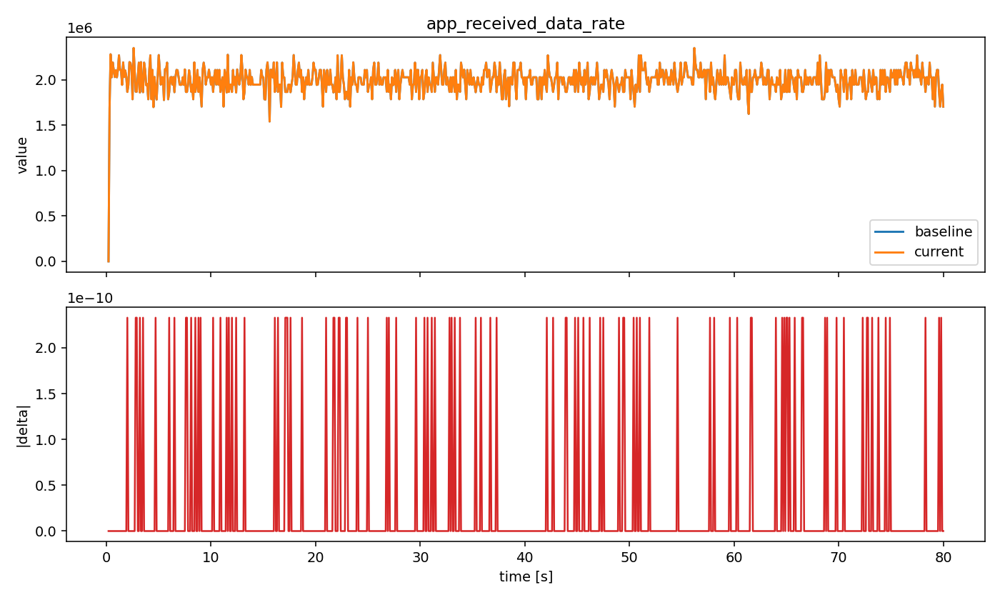</td>
    <td width="50%">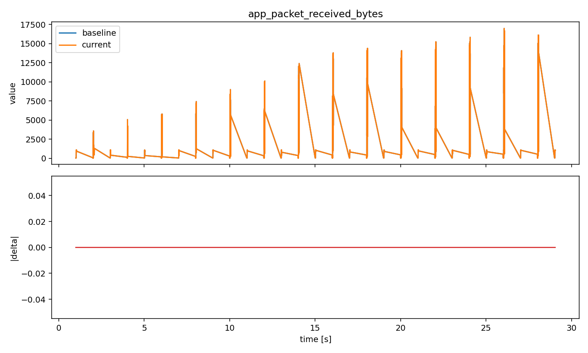</td>
  </tr>
  <tr>
    <td><em>Figure 1. Aggregated application-layer received data-rate trajectory (cmp_vadere_sumo_sumo_bottleneck).</em></td>
    <td><em>Figure 2. Application-layer received byte-flow (covicom21_vadere_60) over time.</em></td>
  </tr>
  <tr>
    <td width="50%">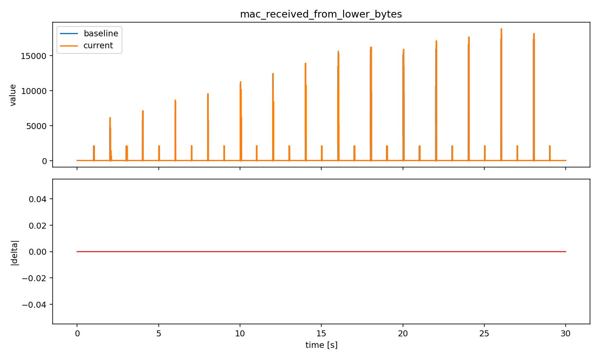</td>
    <td width="50%">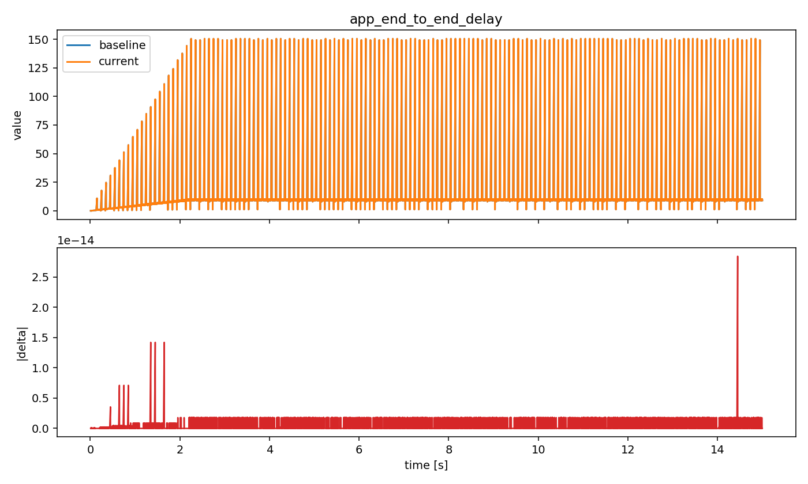</td>
  </tr>
  <tr>
    <td><em>Figure 3. MAC-layer received-from-lower byte-flow (covicom21_vadere_60).</em></td>
    <td><em>Figure 4. End-to-end delay evolution (openair_s4).</em></td>
  </tr>
  <tr>
    <td width="50%">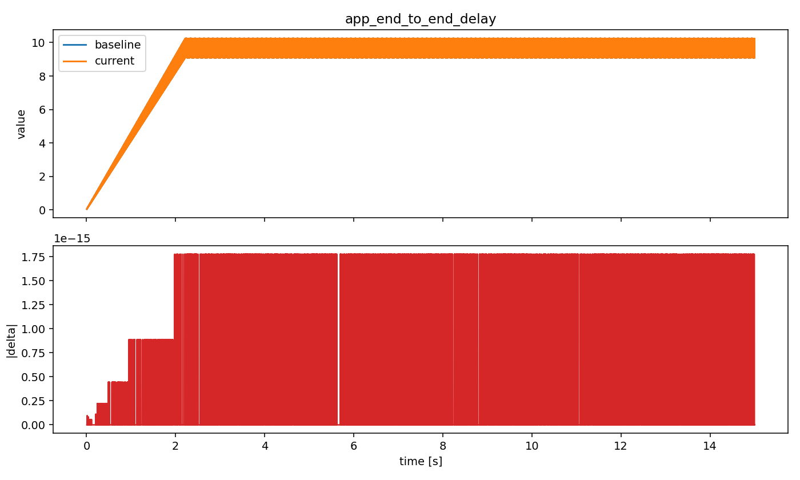</td>
    <td width="50%">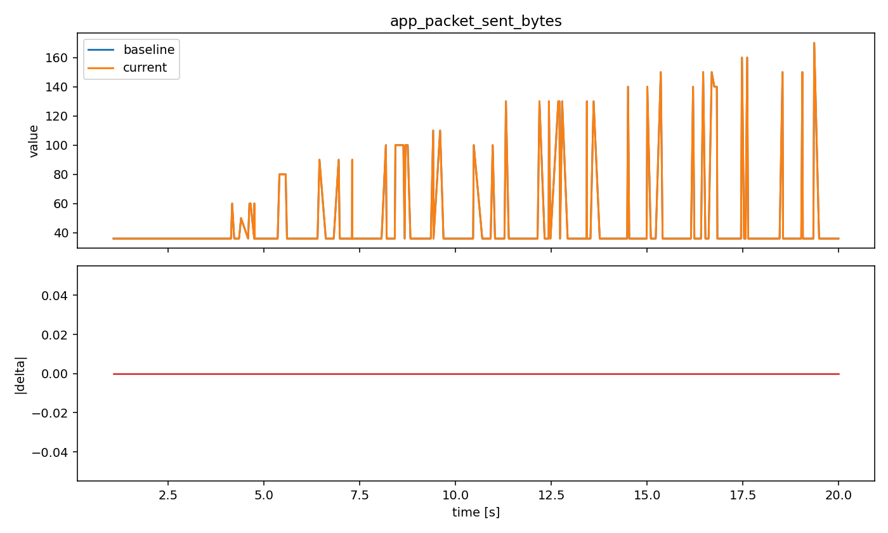</td>
  </tr>
  <tr>
    <td><em>Figure 5. End-to-end delay profile (openair_s4_ua).</em></td>
    <td><em>Figure 6. Application-layer sent byte-flow (vadere_corridor_ramp_down).</em></td>
  </tr>
</table>

## Interpreting threshold exceedance after dependency upgrades

After upgrading SUMO, Vadere, and OMNeT++, test cases can show threshold
exceedance in result comparison although the underlying simulation behavior
remains qualitatively stable.

This is an expected risk when numerical kernels, scheduler details, random
number generation internals, or low-level floating-point behavior change across
dependency versions. In such cases, deviations from historical
baselines can be observed even when model-level behavior does not materially change.

The following plots document representative
post-upgrade outcomes where thresholds were exceeded but trend structure and
relative dynamics remained consistent.

<table>
  <tr>
    <td width="50%">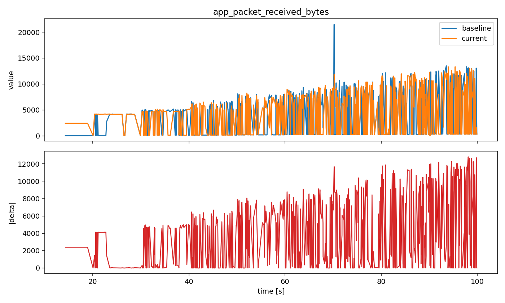</td>
    <td width="50%">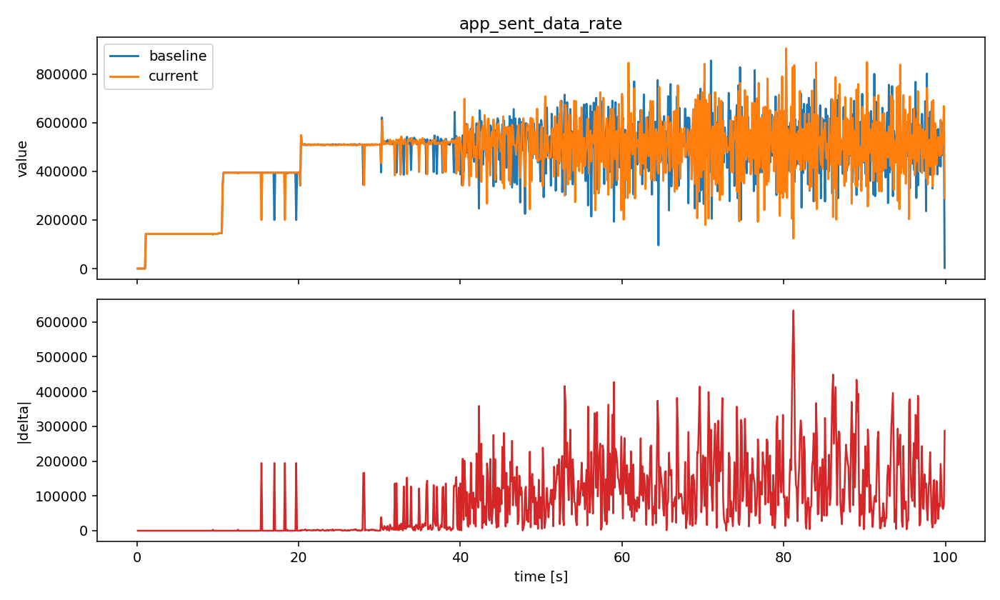</td>
  </tr>
  <tr>
    <td><em>Figure 7. Post-upgrade comparison for arcdsa_lab_upto_14_ue_ramp_nr on application received byte-flow. Despite threshold exceedance, the dominant time-dependent structure remains comparable to the baseline reference.</em></td>
    <td><em>Figure 8. Post-upgrade comparison for arcdsa_lab_upto_14_ue_ramp_nr on application sent data rate. The observed differences primarily reflect numerical offset and local amplitude variation rather than a regime change.</em></td>
  </tr>
  <tr>
    <td width="50%">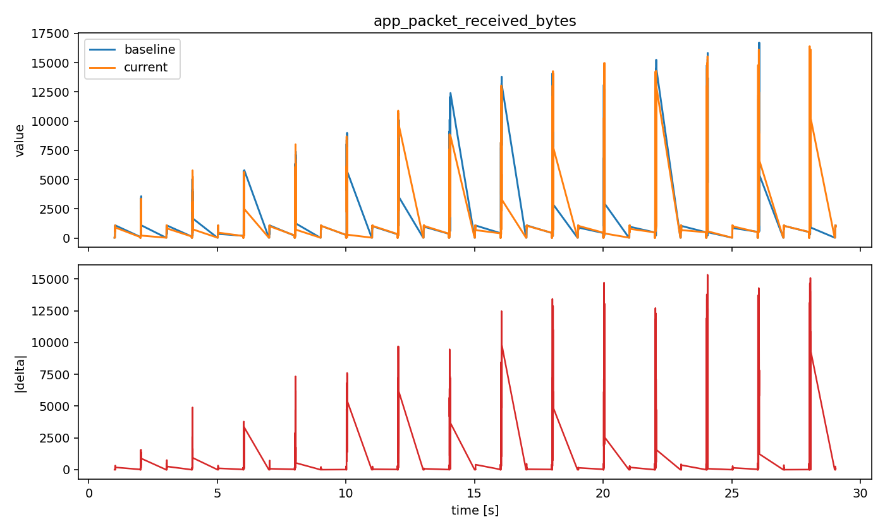</td>
    <td width="50%">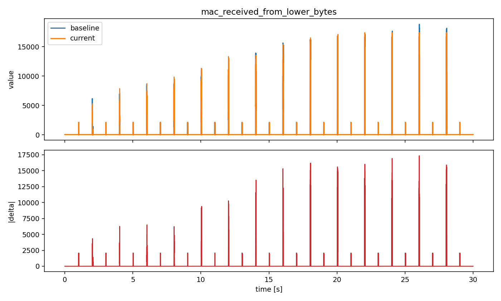</td>
  </tr>
  <tr>
    <td><em>Figure 9. Post-upgrade comparison for covicom21_vadere_60 on application received bytes. Global trend direction and event timing remain aligned with the pre-upgrade baseline behavior.</em></td>
    <td><em>Figure 10. Post-upgrade comparison for covicom21_vadere_60 at MAC layer byte-flow. The metric preserves the same operational phases, with bounded deviation around the baseline trace.</em></td>
  </tr>
  <tr>
    <td width="50%">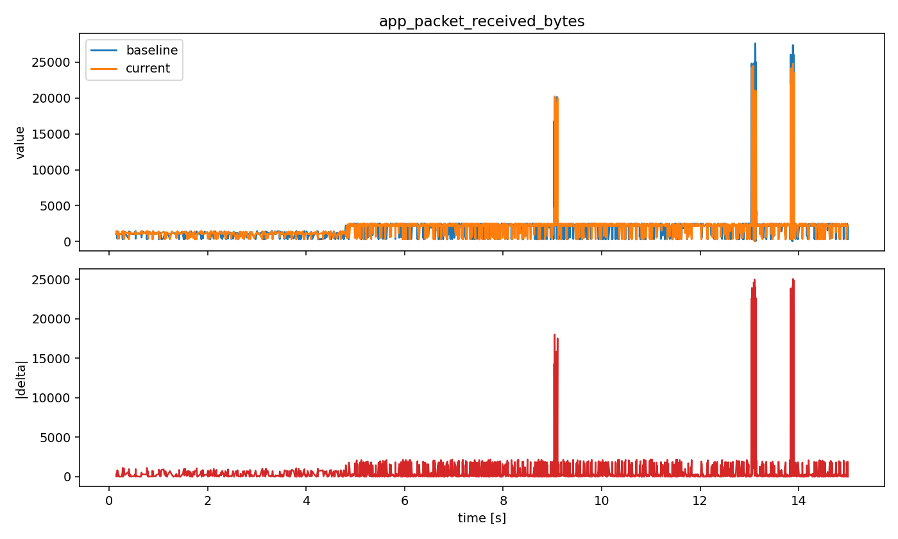</td>
    <td width="50%">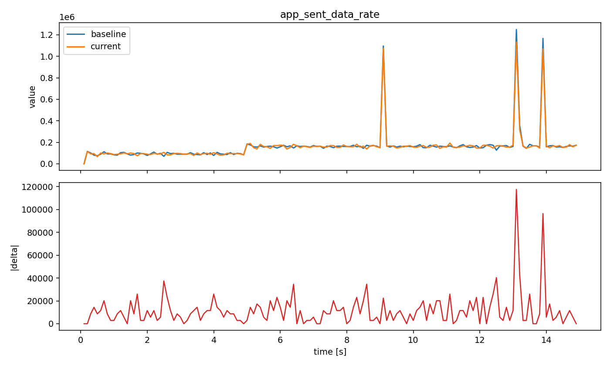</td>
  </tr>
  <tr>
    <td><em>Figure 11. Post-upgrade comparison for mucfreiheit_lte_final on application received bytes. Differences are visible but do not indicate a structural change in communication behavior over the simulated interval.</em></td>
    <td><em>Figure 12. Post-upgrade comparison for mucfreiheit_lte_final on application sent data rate. The principal profile remains stable.</em></td>
  </tr>
</table>
