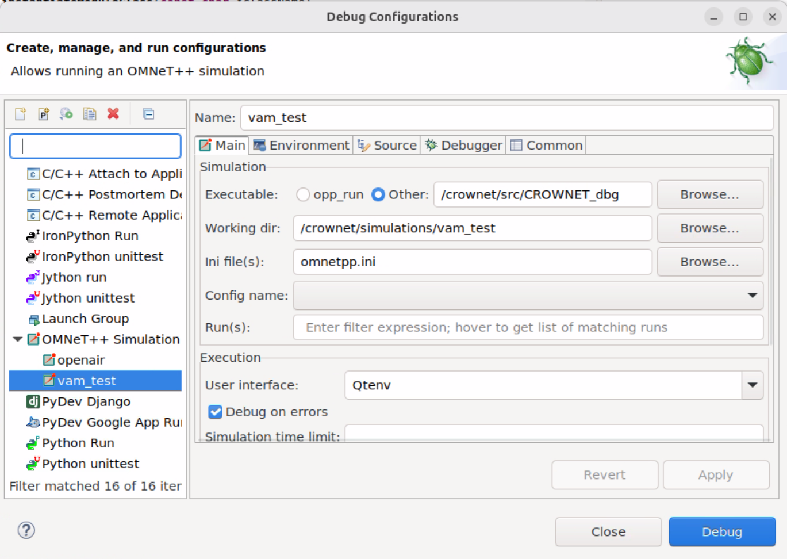

# CrowNet FAQ

## Build Problems

### Errors building *analysis-all* or other Python-based targets
* Remove local build environment: `rm $CROWNET_HOME/out`
* Check that you have the correct Python version (as indicated in the Makefile)

## OMNeT++ IDE

### Java InvocationTargetException
When trying to run or debug a simulation, the IDE shows a "Java InvocationTargetException" without any other details. This can have a number of reasons - try to find the problem by performing the following steps:
* check that your run/debug configuration uses `/crownet/simulations/CROWNET_dbg` to execute the simulation in debug mode (and `/crownet/simulations/CROWNET` in release mode), see . 
* check that all required libraries and executables exists
* check if the error also occurs for the example projects part of OMNeT++ itself
* Try cleaning and rebuilding the whole project.

## Concluding Remarks
If you encounter any other problems, please help us to extend this list of common problems and solutions - contact us by submitting a pull request or via email: <crownet@crownet.org>

