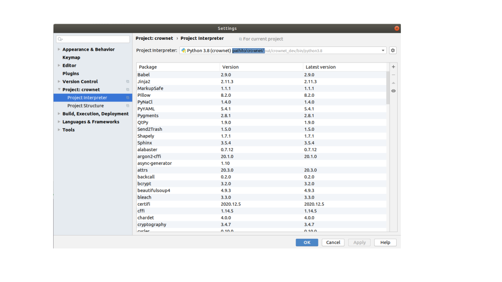
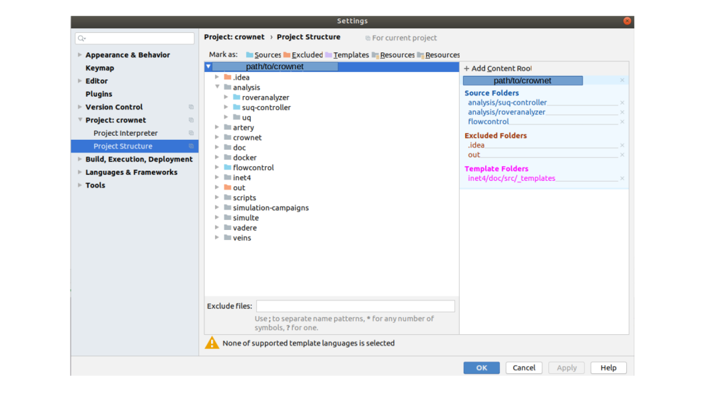
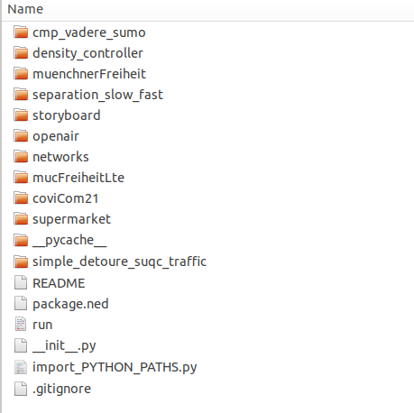
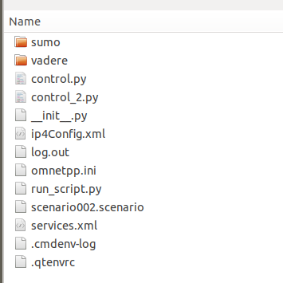

# How to implement and test crowd control in CrowNet

## What is crowd control?

Crowd management deals with the systematic planning of areas and infrastructures, communication offers and organisational structures in relation to pedestrians and their expected behaviour. ([see e.g.](http://www.basigo.de/wiki/index.php5?title=Sicherheitsbausteine/Crowd_Management/Crowd_Management&oldid=5958)). 

Crowd control means that the state of the crowd is continuously measured, and due that,   the control action is changing continously, e.g. by changing sings dynamically. The CrowNet simulator offers the possibility to simulate how pedestrians are guided through a topography using text messages. Like Advanced Traveller Information Systems (ATIS), we acquire, analyze, and present information to assist surface transportation travellers in moving from a starting location (origin) to their desired destination. With CrowNet, the user can implement and test different control strategies (ATIS), while realistically modelling the pedestrian locomotion and the information dissemination through mobile networks.

In the following, we explain hot to run existing and set-up new CrowNet simulations with crowd control.

## System setup
Python >= 3.8 is required. First create the virtual environment (Python >= 3.8 required).
Navigate to the crownet root directory
```
cd $CROWNET_HOME

```
Build the virtual Python environments using
```
omnetpp exec make analysis-all
```
In `crownet/out` you find the two virtual environments
* crownet_user
* crownet_dev
### Run simulations from terminal
Open a terminal and activate previously created virtual environment.
```
source $CROWNET_HOME/out/crownet_user/bin/activate
```
### Run simulations in an IDE
When developing new control strategy, we recommend to use an IDE.

Start any IDE. Set the crownet root directy as project root. The project root is
```
echo $CROWNET_HOME
```
Choose the virtual enviroment `crownet/out/crownet_dev/bin/python3.8` as project interpreter.


Next, add the following directories to the project source for navigating easily through the codebase:
* crownet/analysis/roveranalyzer
* crownet/analysis/suq-controller
* crownet/flowcontrol




### Running existing simulations with control

CrowNet Simulations can be run with and without control strategy. If a control strategy should be applied, a `control.py` file must be provided in the simulation directory. Existing CrowNet Simulations can be found in the CrowNet repository under
`crownet/crownet/simulations`:


We will use the simple_detour_suqc_traffic simulation as example:



## Step 1: Test the crowd control strategy without mobile networks
In the first step, the control strategy should be tested without mobile networks. That means, that virtual pedestrians (agents) are immediately informed. This is the ideal case. The means of transmission is not modeled. Only if the strategy is successful, the developer should move on to step 2, where the information is disseminated through mobile networks.

In step 1, only the crowd simulator Vadere and the control framework FlowControl is required (VadereControl). The simulation of the mobile network part is left out. 

There are four possibilities how the VadereControl simulation can be run.

|  			 # 		   |  			 Simulation 		 |  			   			 		               |  			 Entrypoint 		    |  			 Scope 		                                   |  			 Visualization 		             |
|--------|---------------|---------------------|------------------|--------------------------------------------|------------------------------|
|  			 1-1 		 |  			 Run  			 		      |  			 container-based 		  |  			 run_script.py 		 |  			 Run existing simulations 		                |  			 ? 		                         |
|  			 1-2 		 |  			   			 		         |  			 local 		            |  			 control.py 		    |  			   			 		                                      |  			 Switch on/off: vadere-gui 		 |
|  			 1-3 		 |  			 Debug  			 		    |  			 control 		          |  			 control.py 		    |  			 Investigate control strategy 		            |  			 Switch on/off: vadere-gui 		 |
|  			 1-4 		 |  			   			 		         |  			 control + vadere 		 |  			 control.py 		    |  			 Investigate control strategy and vadere 		 |  			 Switch on/off: vadere-gui 		 |


### 1-1 Run VadereControl as black-box simulator (container-based)

#### From terminal

If not active yet, activate the previously created virtual enviroment
```
source $CROWNET_HOME/.venv/bin/activate
```
To run VadereControl as black-box, navigate to the simulation directory
```
cd $CROWNET_HOME/crownet/simulations/simple_detoure_suqc_traffic

```
Start the run_script
```
python3 run_script.py --experiment-label test --delete-existing-containers --create-vadere-container --with-control control.py --control-vadere-only --scenario $PWD/scenario002.scenario

```
The simulation output can be found in `vadere-server-output`.

#### In IDE
Optional: to overwrite the settings defined in __main__, add `--experiment-label test --delete-existing-containers --create-vadere-container --with-control control.py --control-vadere-only --scenario $PWD/scenario002.scenario` to Configuration/arguements.

Start run_script.py. 

### 1-2 Run VadereControl (locally)
If the control strategy is succesful, ... explain here why to run locally

If not active yet, activate the previously created virtual enviroment
```
source $CROWNET_HOME/.venv/bin/activate
```
Start the simulation without containers.
```
python3 control.py --port 9999 --host-name vadere --client-mode --scenario $PWD/scenario002.scenario
```


