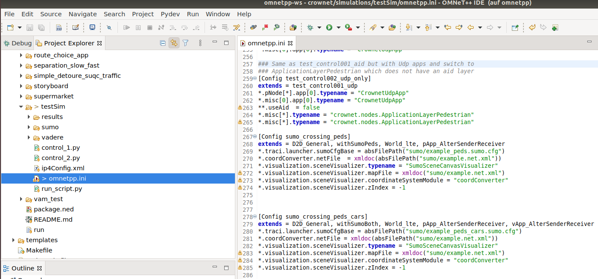
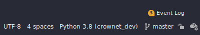
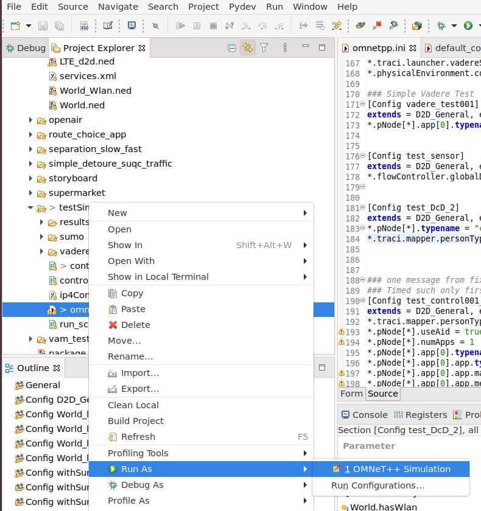
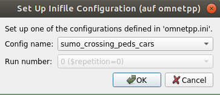
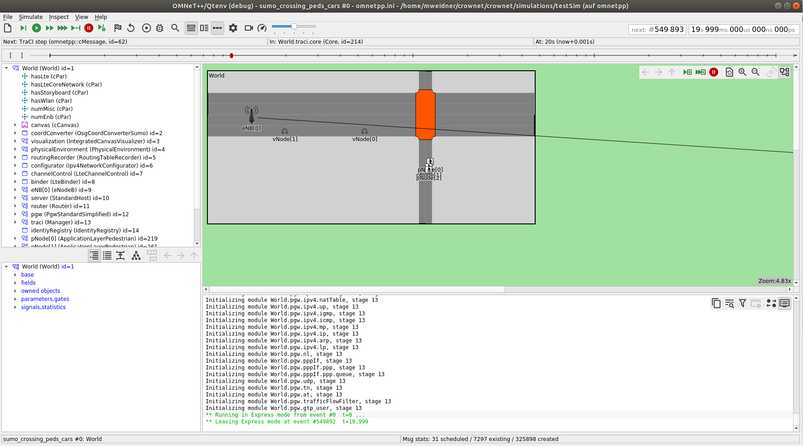

# Simulation with IDE support

## Prepare the IDEs
### Omnetpp++: Setup the Eclipse-IDE
The eclipse environment OMNeT++ IDE uses a workspace directory to store its preferences and development artifacts. Do the following steps to create and save a project.
#### Step 1: Create folder for meta-files
Create a folder in your repository
```
mkdir omnetpp-ws
```
#### Step 2: Start the omnetpp container and import the subprojects
Start the omnetpp container:
```
omnetpp-ide
```
#### Step 3: Import project with sub modules
Choose File>Import>General>Existing projects> and import following folders:
* inet4
* crownet
* simu5g
* artery

When importing the folder veins only import the modules 1 (veins) and 3 (inet).
* veins

#### Step 4: Close and restart the Environment
Choose the folder omnetpp-ws to see the project which was just created.

# Run the simulation
In order for the simulation to run, make sure all the necessary services are running (f.e. in different terminals).

 * Open up the omnetpp-ide
   * terminal-1: `omnetpp-ide`
  * start the flowcontrol-container
    * terminal-2: `control-ide`
    * opens pycharm (later used to start mobility provider)
  * start a mobility container (sumo|vadere):
    * terminal-3: `sumo`
    * terminal-3: `vadere`

Then in the omnet-ide select your `omnetpp.ini`, right click it and either select `Run as` or `Debug as`. After the simulation UI shows up, select your configuration (from `omnetpp.ini` \[config_name_here\]) and press `ok`.

<!-- ## About the tools -->

## Example

Let's run the `sumo_crossing_peds_cars` inside `crownet/crownet/simulations/testSim`. This is a simple simulation with two pedestrians and a crossing (without cars). The three persons are walking side by side.

1. Start the omnetpp-ide to take a look at the simulation

    the omnet ide can be started with the terminal command: `omnetpp-ide`


We know, that our configuration has `sumo` in its name, but now we see, that it also extends the `withSumoPeds` network-configuration. Therefore, we need to start up the `sumo` mobility container

2. start the mobility container with 

    to start the `sumo` container, open a new terminal and type in: `sumo`

3. Let's check out the `withSumoPeds` configuration does

    we can't find it in the `omnetpp.ini` file, let's check out the `default_configs.ini`


```yaml
[Config withSumoPeds]
extends = withSumoBase
**.ignoreVehicle = true
**.ignorePersons = false
```

The `withSumoPeds` seems to further extend the `withSumoBase` configuration. To see what the configuration does, we need to check this parent as well.

```yaml
[Config withSumoBase]
*.traci.core.typename = "Core"
*.traci.core.version = -1
*.traci.core.selfStopping = false
*.traci.launcher.typename = "SumoLauchner"
*.traci.launcher.hostname = "sumo"
*.traci.launcher.port = 9999
*.traci.mapper.typename = "BasicModuleMapper"
*.traci.mapper.personType = "crownet.nodes.ApplicationLayerPedestrian"
*.traci.mapper.vehicleType = "crownet.nodes.ApplicationLayerVehicle"
*.traci.nodes.typename = "SumoCombinedNodeManager"
*.traci.nodes.personSinkModule = ".mobility"
*.traci.nodes.vehicleSinkModule = ".mobility"
*.traci.nodes.personNode = "pNode"
*.traci.nodes.vehicleNode = "vNode"
*.traci.subscriptions.typename = "BasicSubscriptionManager"
# actiavete visualisation. replace with "" empty string to deactivate
*.*Node[*].mobility.visualRepresentation = "^"

*.coordConverter.typename = "OsgCoordConverterSumo"
*.coordConverter.epsg_code = "EPSG:32632"
*.coordConverter.coreModule ="traci.core"
**.useVadere = false
```
Now we finaly see the configuration for our mobility provider. 
In order for components to communitcate with each other it is important, that we set the ports correctly. In our configuration we see, that we configured omnet to expect sumo to be on port `9999`.

If we take a look at our sumo terminal, we see that it printed out: `Listening on port 9999`.

Seems good, both application are configured on the correct port.

**Note:** If we want our application to use another port, we don't need to change the `withSumoBase` since it would definitely break stuff somewhere else. A better approach would be to override the `*.traci.launcher.port` parameter in our `sumo_crossing_peds_cars` configuration.

4. Start the flowcontrol service
   
   to start the flowcontrol ide (pycharm), run `control-ide` in a new terminal

The different control strategies are implemented in a controller, that can be started within the control-ide. The `control_x.py` script inside the simulation folder provides a control controller for this simulation. This script needs to be run with the `control-ide` we opened not a while ago. 

First, we need to make sure, that we have configured the right python environment for our project. (We builded the venvs with `analysis-all` in a previous tutorial)

Make sure the `crownet_dev` is selected as the python environment in the bottom right corner of pycharm.

 

After that, we navigate to `crownet/crownet/simulations/testSim/control_1.py` and open the script.

We right-click inside the script and chose the `run control_1` option to start the controller. 

Now the controller is running and waiting for a connection.

5. Start the simulation

    To start the simulation, right-click the `omnetpp.ini` file inside the `omnet-ide` window and click `Run As > OMNeT++ Simulation`



This will bring up a new window for the graphical visualization of the simulation. It is asking for a configuration name. We now select our previous created simulation `sumo_crossing_peds_cars`  



After selection a configuration, we are ready to start the simulation. The following window displays the simulation. After pressing the "play" button (triangle) the simulation should start. There are also option to "Fast Run", "Express Run" and "Run to event".



6. Let's have a look how the simulation scenario is being set up
   
   in our omnetpp.ini we see the following line: `*.traci.launcher.sumoCfgBase = absFilePath("sumo/example_peds_cars.sumo.cfg")`

   Open the file `sumo/example_peds_cars.sumo.cfg`

We now see the input files for the sumo config in xml style

```xml
  <input>
      <net-file value="example.net.xml"/>
      <route-files value="example_peds_cars.rou.xml"/>
  </input>
```
Let's look closer into the `example_peds_cars.rou.xml` to see how the routes are set up.

```xml
  ...
  <person id="1" depart="0.00">
      <walk edges="-e_C_p0 -e_p1_C"/>
  </person>
  ...
  <vType id="type1" accel="0.8" decel="4.5" sigma="0.5" length="5" maxSpeed="70"/>
  <vehicle id="5" type="type1" depart="10.0" color="1,0,0">
    <route edges="e_v0_C e_C_v1"/>
  </vehicle>
  ...
```
We now see, that there are different tags.
The person tag is a simple pedestrian with the id of `1`. 
He will start at simulation timestep `0.00` and walks from the edge `-e_C_p0` to `-e_p1_C`.
The definition of edges can be found in the file `example.net.xml`

The same applies to the vehicle. But for the vehicle, has the type `type1`. This modifies the acceleration, deceleration and maxSpeed to give cars different behavior.