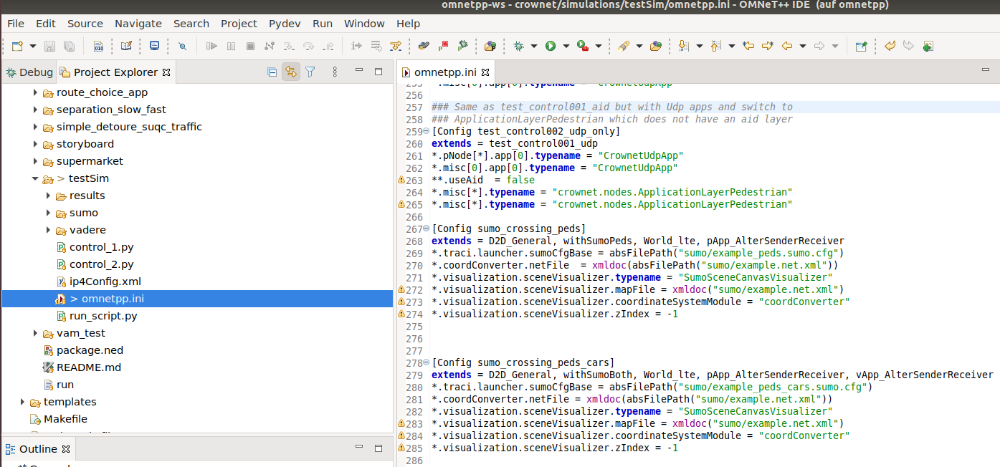
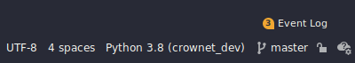
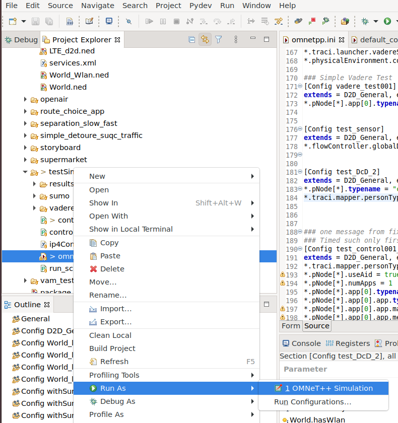
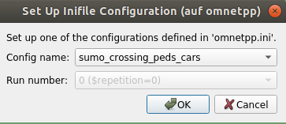
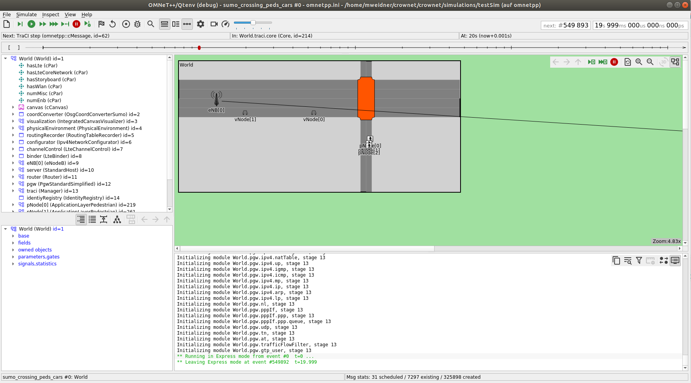

# Simulation with IDE support

## Prepare the IDEs
### OMNeT++: set up the Eclipse IDE
The OMNeT++ IDE uses a workspace directory to store preferences and development artifacts. Follow these steps to create and save a project.
#### Step 1: Create a folder for workspace metadata
Create a folder in your repository:
```
mkdir omnetpp-ws
```
#### Step 2: Start the OMNeT++ container and import the subprojects
Start the omnetpp container:
```
omnetpp-ide
```
#### Step 3: Import projects with submodules
Choose `File > Import > General > Existing projects` and import the following folders:
* inet4
* crownet
* simu5g
* artery

When importing the `veins` folder, import only modules 1 (`veins`) and 3 (`inet`).
* veins

#### Step 4: Close and restart the environment
Choose the `omnetpp-ws` folder to open the project you just created.

# Run the simulation
To run the simulation, make sure all required services are running (for example, in different terminals).

 * Open the OMNeT++ IDE
   * terminal-1: `omnetpp-ide`
  * start the flowcontrol-container
    * terminal-2: `flowcontrol-ide`
    * opens pycharm (later used to start mobility provider)
  * start a mobility container (sumo|vadere):
    * terminal-3: `sumo`
    * terminal-3: `vadere`

Then, in the OMNeT++ IDE, select your `omnetpp.ini`, right-click it, and choose `Run as` or `Debug as`. After the simulation UI appears, select your configuration (from `omnetpp.ini` `[config_name_here]`) and press `OK`.

<!-- ## About the tools -->

## Example

Let's run `sumo_crossing_peds_cars` inside `crownet/simulations/testSim`. This is a simple simulation with two pedestrians and a crossing (without cars). The three persons are walking side by side.

1. Start `omnetpp-ide` to inspect the simulation

  The OMNeT++ IDE can be started with the terminal command: `omnetpp-ide`


We know our configuration has `sumo` in its name, and now we can see that it also extends the `withSumoPeds` network configuration. Therefore, we need to start the `sumo` mobility container.

2. Start the mobility container

  To start the `sumo` container, open a new terminal and run: `sumo`

3. Let's check what the `withSumoPeds` configuration does

  We cannot find it in `omnetpp.ini`, so let's inspect `default_configs.ini`.


```yaml
[Config withSumoPeds]
extends = withSumoBase
**.ignoreVehicle = true
**.ignorePersons = false
```

The `withSumoPeds` seems to further extend the `withSumoBase` configuration. To see what the configuration does, we need to check this parent as well.

```yaml
[Config withSumoBase]
*.traci.core.typename = "Core"
*.traci.core.version = -1
*.traci.core.selfStopping = false
*.traci.launcher.typename = "SumoLauncher"
*.traci.launcher.hostname = "sumo"
*.traci.launcher.port = 9999
*.traci.mapper.typename = "BasicModuleMapper"
*.traci.mapper.personType = "crownet.nodes.ApplicationLayerPedestrian"
*.traci.mapper.vehicleType = "crownet.nodes.ApplicationLayerVehicle"
*.traci.nodes.typename = "SumoCombinedNodeManager"
*.traci.nodes.personSinkModule = ".mobility"
*.traci.nodes.vehicleSinkModule = ".mobility"
*.traci.nodes.personNode = "pNode"
*.traci.nodes.vehicleNode = "vNode"
*.traci.subscriptions.typename = "BasicSubscriptionManager"
# activate visualization; replace with an empty string ("") to deactivate
*.*Node[*].mobility.visualRepresentation = "^"

*.coordConverter.typename = "OsgCoordConverterSumo"
*.coordConverter.epsg_code = "EPSG:32632"
*.coordConverter.coreModule ="traci.core"
**.useVadere = false
```
Now we finally see the configuration for our mobility provider.
For components to communicate correctly, ports must be configured consistently. In this configuration, OMNeT++ expects SUMO on port `9999`.

If we take a look at our sumo terminal, we see that it printed out: `Listening on port 9999`.

Looks good, both applications are configured on the correct port.

**Note:** If we want our application to use another port, we don't need to change the `withSumoBase` since it would definitely break stuff somewhere else. A better approach would be to override the `*.traci.launcher.port` parameter in our `sumo_crossing_peds_cars` configuration.

4. Start the flowcontrol service
   
  To start the flowcontrol IDE (PyCharm), run `flowcontrol-ide` in a new terminal.

Different control strategies are implemented in controllers that can be started in the flowcontrol IDE. The `control_x.py` script inside the simulation folder provides the controller for this simulation. This script must be run from the `flowcontrol-ide` instance opened above.

First, make sure the correct Python environment is configured for the project. (The virtual environments were created with `analysis-all` in a previous tutorial.)

Make sure `crownet_dev` is selected as the Python environment in the bottom-right corner of PyCharm.

 

After that, navigate to `crownet/simulations/testSim/control_1.py` and open the script.

Right-click inside the script and choose `Run control_1` to start the controller.

Now the controller is running and waiting for a connection.

5. Start the simulation

    To start the simulation, right-click the `omnetpp.ini` file inside the OMNeT++ IDE window and click `Run As > OMNeT++ Simulation`



This opens a new window with the graphical visualization of the simulation. It asks for a configuration name. Select the previously created simulation `sumo_crossing_peds_cars`.



After selecting a configuration, you are ready to start the simulation. The following window displays the simulation. Press the "play" button (triangle) to start it. There are also options for "Fast Run", "Express Run", and "Run to event".



6. Let's look at how the simulation scenario is set up
   
  In `omnetpp.ini`, we see the following line: `*.traci.launcher.sumoCfgBase = absFilePath("sumo/example_peds_cars.sumo.cfg")`

   Open the file `sumo/example_peds_cars.sumo.cfg`

We now see the input files for the SUMO configuration in XML format.

```xml
  <input>
      <net-file value="example.net.xml"/>
      <route-files value="example_peds_cars.rou.xml"/>
  </input>
```
Let's look closer into the `example_peds_cars.rou.xml` to see how the routes are set up.

```xml
  ...
  <person id="1" depart="0.00">
      <walk edges="-e_C_p0 -e_p1_C"/>
  </person>
  ...
  <vType id="type1" accel="0.8" decel="4.5" sigma="0.5" length="5" maxSpeed="70"/>
  <vehicle id="5" type="type1" depart="10.0" color="1,0,0">
    <route edges="e_v0_C e_C_v1"/>
  </vehicle>
  ...
```
We now see that there are different tags.
The person tag is a simple pedestrian with the id of `1`. 
He will start at simulation timestep `0.00` and walks from the edge `-e_C_p0` to `-e_p1_C`.
The definition of edges can be found in `example.net.xml`.

The same principle applies to the vehicle entry. The vehicle has type `type1`, which modifies acceleration, deceleration, and max speed to model different car behavior.