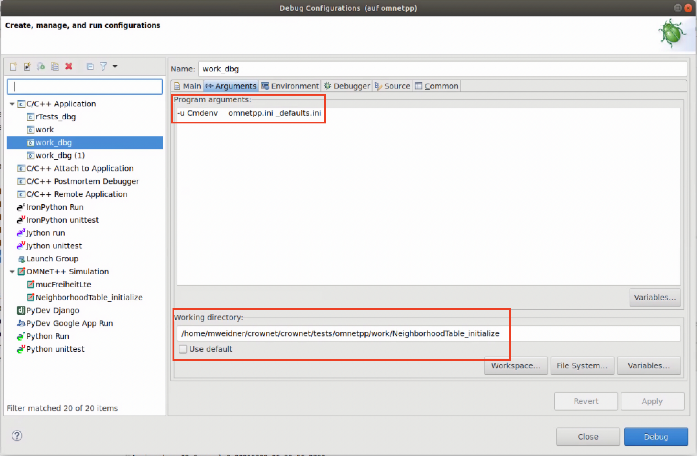

# opp_test tool

The `opp_test` tool is a Python tool used to test the OMNeT++ simulation kernel. It converts a `.test` file into a runnable executable. Each `.test` file is compiled into a subfolder with the same name (`sample.test` -> `sample/`).

CrowNet `opp_test` files can be found under `crownet/tests/omnetpp`.
The whole `opp_test` process is wrapped by a shell script called `runtest`. This script sets variables to build the executable and runs all tests.

## Debugging
1. To debug `.test` files, build all modules in debug mode and adjust the `runtest` script accordingly. The `runtest` script must build in debug mode (`MAKE="make MODE=debug"`), and linked libraries must also be built in debug mode (for example, `EXTRA_INCLUDES="$CROWNET_INCLUDE $INET_INCLUDE -lINET_dbg -lCROWNET_dbg"`).

2. Execute `./runtest` (creates a C++ executable and subfolders for each `.test` file).

3. To debug a specific test (`/subfolder`), edit the debug configuration (in `omnetpp-ide`: right-click the executable (`work_dbg`) -> Debug as -> Debug Configuration):
    * in the arguments section, copy the arguments from the generated file `<subfolder>/run` (for example, `-u Cmdenv _defaults.ini`, without the `export` line and the `"$@"` at the end)
    * IMPORTANT: uncheck the checkbox `Use default` and set it to the directory of the `subfolder`



## .test-file sections
The opp_test tool generates code based on sections in the .test-file. Each section starts with an `%` and ends with the end of file or a new section. Below are some notes from us, to document some specific behavior of a section. If you want to know how to use them, please visit: https://doc.omnetpp.org/omnetpp/manual/#cha:testing
### %file
Creates a new file with the given filename in the `/subfolder`.
Although it can be any kind of file (.net, .cc, .json, ...), it is recommended to use the %inifile section for .ini-files.

### %inifile
Creates a .ini-file for the test to initialize the test simulation. This .ini-file can contain known variables like `sim-time-limit`. Be aware that the opp_test tool generates some default values and overriding these values might cause errors. 
```
[General]
network = Test
cmdenv-express-mode = false
cmdenv-log-prefix = ""
```
It is not recommended to call your network `Test`.
### %global
Used to write c++ code and make it global to the created module. Can be a function that can be run in the %activity section.
### %activity
Used to run custom code. OMNeT++ generates a new NED and INI file for this module. This is useful for testing single units with little to no OMNeT++ dependencies. Make sure to print important logic to stdout for validation.
### %contains %not-contains
Checks if a block of text is/is not present in the file (stdout/stderr). If one wants to test multiple lines with any amount of lines between them, multiple %contains/%not-contains are needed.
### %contains-regex %not-contains-regex
Checks if a certain regex is/is not present in a given file. Uses perl syntax for regex. (See perl cheat sheet in [useful links](#useful-links))

# Useful links
* opp_test source file: [opp_test.py](https://github.com/omnetpp/omnetpp/blob/master/src/utils/opp_test)

* The omnetpp test docs: [omnetpp testing docs](https://doc.omnetpp.org/omnetpp/manual/#cha:testing) 

* Perl regex cheat sheet (for %contains-regex in .test-file): [cheat sheet](https://www.geeksforgeeks.org/perl-regex-cheat-sheet/)