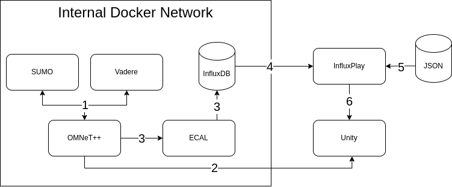

# Write Traces to InfluxDB and 3D Scenarios with Unity
This section describes how any value can be stored in a local deployed InfluxDB file instead of using the [ResultFilter](https://doc.omnetpp.org/omnetpp/api/classomnetpp_1_1cResultFilter.html) SQL approach, that only supports signal updates by default. In addition it references a 3D display solution without osgEarth and OpenSceneGraph provided by OMNeT++.


# Architecture
The OMNeT++, Sumo and Vadere connection (1) is extended by ECAL receiving messages (3) and storing them into a InfluxDB instance.
(4). InfluxDB itself shares its data with InfluxPlay that alternatively can use JSON files (5) to send messages to Unity (6), such as position data or network updates. If message storing is not required OMNeT++ is directly connected to Unity (2).




# Repositories
The functionality described under `Architecture` is not part of the crownet repository.
- Message receiving and storing with [Event Controller and Logger (ECAL)](https://github.com/skiunke/EventControllerAndLogger).
- [3D simulation in Unity](https://github.com/skiunke/CrownetUnity) with support for vehicle and person movements and package updates.


# Usage
The [Unity](../../crownet/src/crownet/unity) package in crownet implements support for signals updating movement and network information within scenarios. These values are forwarded to ECAL by enabling the following settings in the `omnetpp.ini` file of the selected scenario.
```bash
*.visualization.mobilityVisualizer.typename ="UnityMobilityVisualizer"
*.visualization.physicalLinkVisualizer.typename = "UnityNetworkVisualizer"
*.visualization.physicalLinkVisualizer.displayLinks = true
 ```

1. Run the [ECAL](https://github.com/skiunke/EventControllerAndLogger) docker container.
2. (optional) Start the Unity Scenario.
2. Start your scenario -> OMNeT++ should automatically connect to ECAL and if used Unity on default ports.
3. Run your scenario and view data live under http://localhost:8086 or alternatively in Unity.