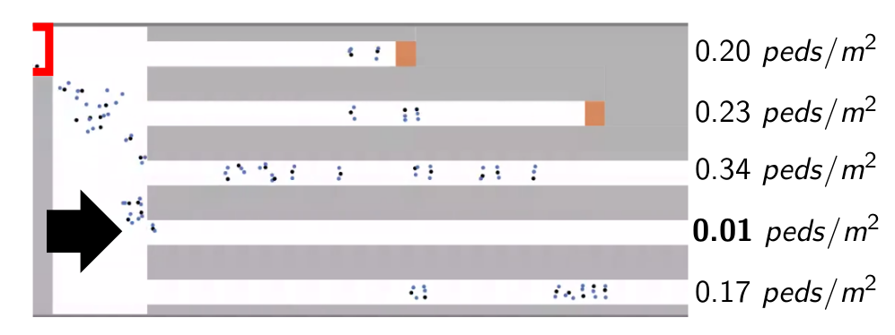
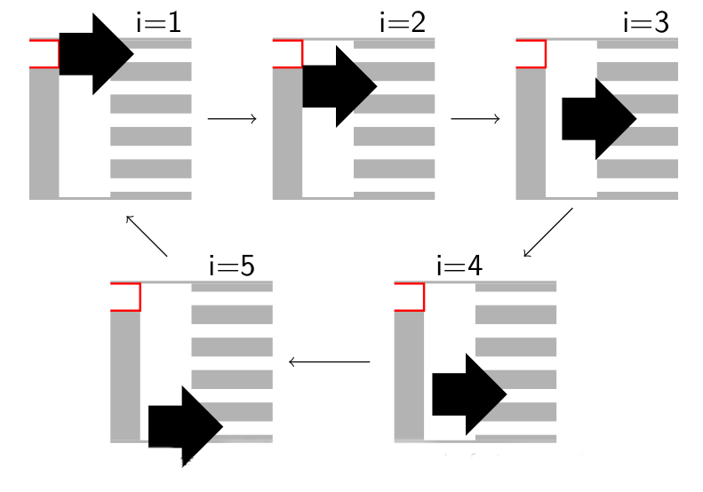
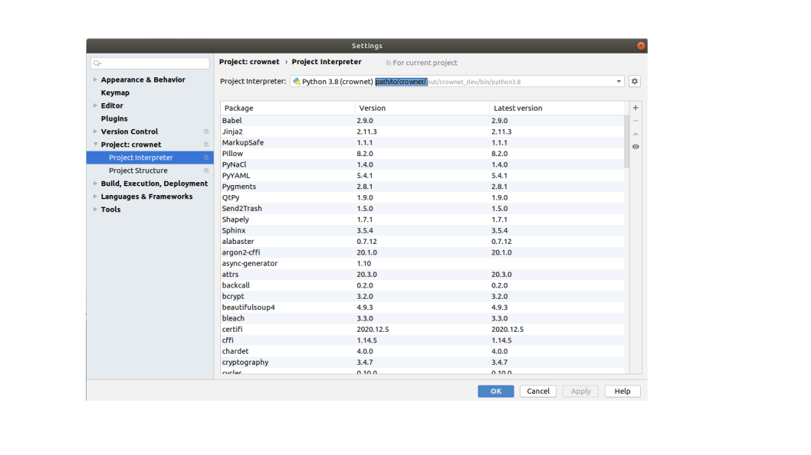
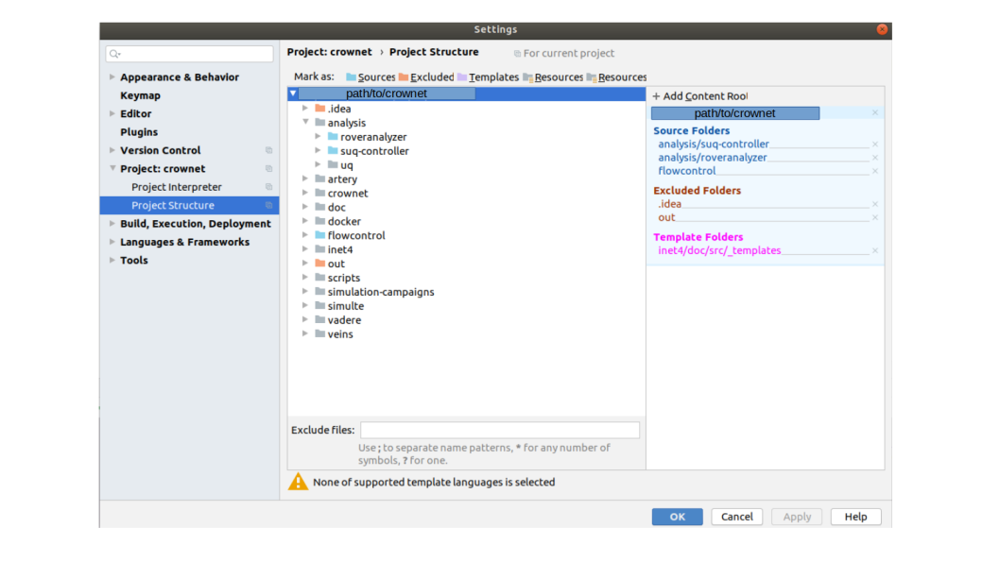
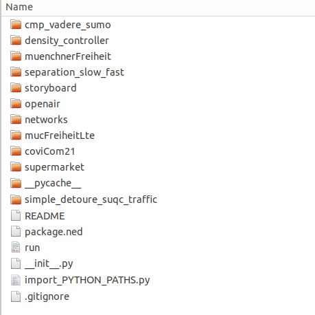
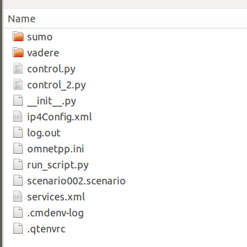

# How to implement and test crowd control in CrowNet

## What is crowd control?

Crowd management deals with the systematic planning of areas and infrastructures, communication offers and organisational structures in relation to pedestrians and their expected behaviour. ([see e.g.](http://www.basigo.de/wiki/index.php5?title=Sicherheitsbausteine/Crowd_Management/Crowd_Management&oldid=5958)). 

Crowd control means that the state of the crowd is continuously measured, and control actions are adjusted continuously, for example by changing signs dynamically. The CrowNet simulator makes it possible to simulate how pedestrians are guided through a topography using text messages. Similar to Advanced Traveller Information Systems (ATIS), we acquire, analyze, and present information to assist travelers in moving from an origin to a destination. With CrowNet, users can implement and test different control strategies while realistically modeling pedestrian locomotion and information dissemination through mobile networks.

The flowcontrol Python framework integrated in CrowNet provides several guiding strategies. One example is the
density based algorithm that redirects pedestrians to the route where the density is the lowest.
Another example is the simple distribution algorithm where pedestrians are redirected sequentially.
With flowcontrol, new guiding strategies can also be developed and tested within the CrowNet framework.


| Density based approach | Simple distribution                                              |
|------------------------|------------------------------------------------------------------|
|    |  |                      


In the following, we explain how to run existing CrowNet simulations with crowd control and how to set up new ones.

## System setup
Python >= 3.8 is required. First, create the virtual environments.
Navigate to the crownet root directory
```
cd $CROWNET_HOME

```
Build the virtual Python environments. Note: Do not use any container to execute that make-target
```
make analysis-all
```
In `crownet/out` you can find the two virtual environments:
* crownet_user
* crownet_dev
### Run simulations from terminal
Open a terminal and activate the previously created virtual environment.
```
source $CROWNET_HOME/out/crownet_user/bin/activate
```
### Run simulations in an IDE
When developing a new control strategy, we recommend using an IDE.

Start any IDE. Set the CrowNet root directory as the project root. The project root is
```
echo $CROWNET_HOME
```
Choose the virtual environment `crownet/out/crownet_dev/bin/python` as the project interpreter.


Next, add the following directories to the project source for navigating easily through the codebase:
* crownet/analysis/crownetutils
* crownet/analysis/suq-controller
* crownet/flowcontrol




### Running existing simulations with control

CrowNet simulations can be run with and without a control strategy. If a control strategy should be applied, a `control.py` file must be provided in the simulation directory. Existing CrowNet simulations can be found in the repository under
`crownet/crownet/simulations`:


We will use the `simple_detoure_suqc_traffic` simulation as an example:



## Step 1: Test the crowd control strategy without mobile networks
In the first step, the control strategy should be tested without mobile networks. This means that virtual pedestrians (agents) are informed immediately. This is the ideal case. The transmission medium is not modeled. Only if this strategy is successful should the developer move on to step 2, where information is disseminated through mobile networks.

In step 1, only the crowd simulator Vadere and the control framework FlowControl are required (VadereControl). The mobile network part is left out.

There are four possibilities how the VadereControl simulation can be run.

|  			 # 		   |  			 Simulation 		 |  			   			 		               |  			 Entrypoint 		    |  			 Scope 		                                   |  			 Visualization 		             |
|--------|---------------|---------------------|------------------|--------------------------------------------|------------------------------|
|  			 1-1 		 |  			 Run  			 		      |  			 container-based 		  |  			 run_script.py 		 |  			 Run existing simulations 		                |  			 ? 		                         |
|  			 1-2 		 |  			   			 		         |  			 local 		            |  			 control.py 		    |  			   			 		                                      |  			 Switch on/off: vadere-gui 		 |
|  			 1-3 		 |  			 Debug  			 		    |  			 control 		          |  			 control.py 		    |  			 Investigate control strategy 		            |  			 Switch on/off: vadere-gui 		 |
|  			 1-4 		 |  			   			 		         |  			 control + vadere 		 |  			 control.py 		    |  			 Investigate control strategy and vadere 		 |  			 Switch on/off: vadere-gui 		 |


### 1-1 Run VadereControl as black-box simulator (container-based)

#### From terminal

If not active yet, activate the previously created virtual environment:
```
source $CROWNET_HOME/out/crownet_user/bin/activate
```
To run VadereControl as black-box, navigate to the simulation directory
```
cd $CROWNET_HOME/crownet/simulations/simple_detoure_suqc_traffic

```
Start the run_script
```
python3 run_script.py --experiment-label test --delete-existing-containers --create-vadere-container --with-control control.py --control-vadere-only --scenario $PWD/scenario002.scenario

```
The simulation output can be found in `vadere-server-output`.

#### In IDE
Optional: to overwrite the settings defined in `__main__`, add `--experiment-label test --delete-existing-containers --create-vadere-container --with-control control.py --control-vadere-only --scenario $PWD/scenario002.scenario` to Configuration/Arguments.

Start run_script.py. 

### 1-2 Run VadereControl (locally)
If the control strategy is successful, local execution can be useful for faster iteration and easier debugging.

If not active yet, activate the previously created virtual environment:
```
source $CROWNET_HOME/out/crownet_user/bin/activate
```
Start the simulation without containers.
```
python3 control.py --port 9999 --host-name vadere --client-mode --scenario $PWD/scenario002.scenario
```


