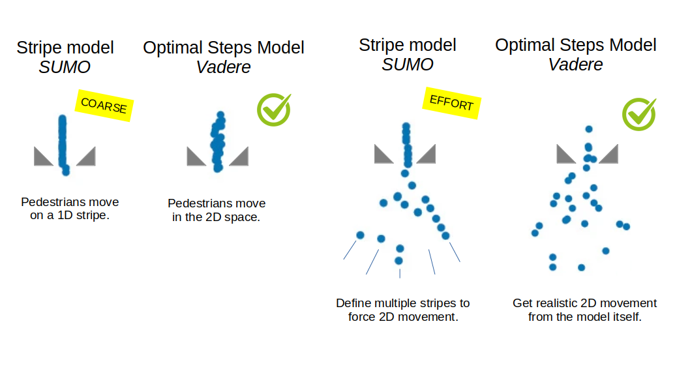

# Detailed pedestrian mobility

The mobility of nodes has a huge impact on the performance of a mobile network. 
Therefore, the position of nodes should be as detailed as possible in the simulation.
However, only coarse pedestrian mobility data is available in many mobile network simulation frameworks.
We overcome this issue by providing accurate position data by integrating the validated pedestrian dynamics simulator [VADERE](http://www.vadere.org/).

## Further information

Please find our [publication](https://link.springer.com/chapter/10.1007/978-3-031-29419-8_1).