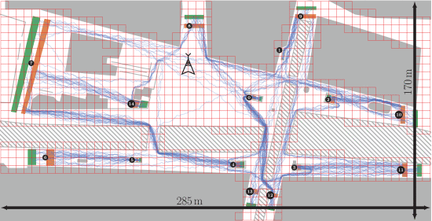

# Density maps: Sidelink based crowd monitoring

A density map is a map that shows spatial distribution of pedestrian density $d$ that is defined as:
$$ d = N / A $$
where $N$ is the number of pedestrians and $A$ is the area of the measurement area.

A density map can be used to identify areas where crowding occurs.
For this purpose, the topography is divided into cells (see the red grid in the image). For each cell (i),
the density $d$ is estimated and updated in periodic time intervals.

## Pedestrian counting through beacons

CrowNet offers a novel approach to estimate the pedestrian density using a counting approach that is based on beacons.
Pedestrians who use the so-called beacon application share their position locally. Pedestrians nearby receive the beacons which are then
used by the density map application to estimate the pedestrian density. 
The density map itself does not contain any information like position data which prevents the tracking of pedestrians.

## Tutorial
Please find an example 

## Further information
Please find a detailed description of the density map in 