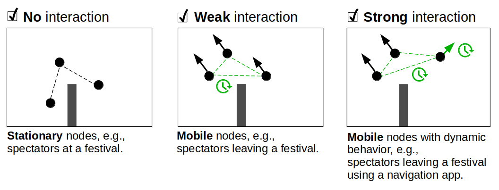

# Interactions between mobility and mobile networks

## Online and offline mobility simulation

There are two approaches to integrate position data provided by a mobility simulator in a mobile network simulation.
In the offline simulation, a microscopic traffic simulation is run before the mobile network simulation. 
The output of the mobility simulation (trajectories) serves as input for the mobile network simulation.
In the online simulation, the mobility and mobile network simulation is executed simultaneously. 
The mobile simulator receives the current position data at specific synchronization times.
The online approach is technically more complex, since an exchange of the simulator states has to be realized, 
but in contrast to the offline variant it offers the possibility to simulate strong interactions.

## Types of interactions
With CrowNet, mobility behavior can be integrated into the mobile network simulation both offline and online. 
The latter enables the simulation of strong interactions between pedestrian mobility behavior and mobile network.
A strong interactions means that the mobility influences the network and the network influences the mobility 
behavior through information provided over the network, e.g., when travelers use a navigation app, 
festival visitors that plan their visit depending on the current capacity, etc.

## Further information
Please find details on the simulator exchange and implementation in our .

