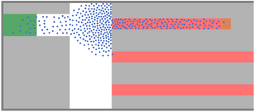

# App based crowd management
Major events cause crowds to gather not only at the event location but also at traffic hubs, for example, before and after soccer matches.
As a result, many subway stations experience congestion. Self-sufficient guidance systems may help to evaluate the situation.
The following figure shows the common situation when a crowd favors a specific route which causes congestion:

## Re-routing of crowds
Re-routing the crowd can alleviate the situation. In CrowNet, re-routing strategies can be tested with the submodule flowcontrol.
Route recommendations are computed based on current density information.

## Tutorial
Please find an example [here](../../crownet/simulations/guiding_crowds_test).

## Further information
Please see our [publication](https://doi.org/10.1371/journal.pone.0276229)