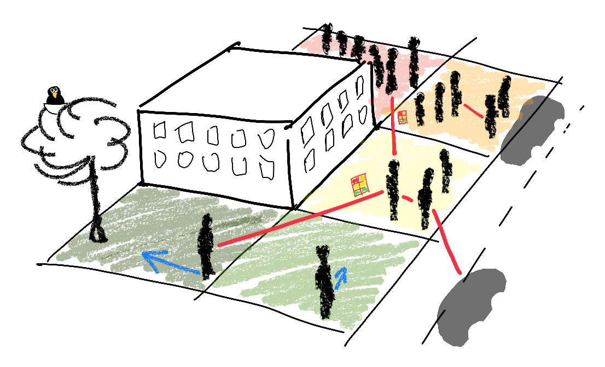
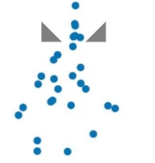
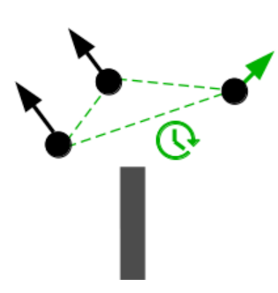
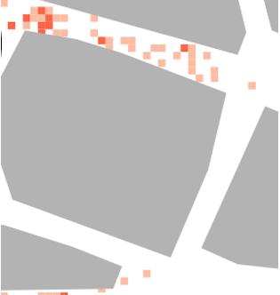
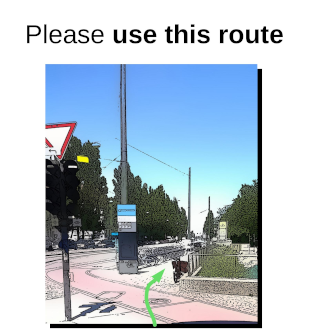

# CrowNet: Crowds in Networks

CrowNet is an open source simulation framework for the development of new networked mobility concepts and intelligent transportation systems. It has been developed as part of the [roVer research project](https://hm.edu/en/research/projects/project_details/wischhof_koester/rover.en.html) at [Munich University of Applied Sciences](https://www.hm.edu/en/index.en.html), funded by the [Federal Ministry of Education and Research](https://www.bmftr.bund.de/EN/Home/home_node.html) (Grant number: 13FH669IX6).

## Features

| [Detailed pedestrian mobility](features/AccuratePedestrianMobility.md) | [Bi-directional interactions](features/Interactions.md) | [Sidelink based crowd monitoring](features/DensityMap.md) | [App based crowd management](features/RouteRecommendation.md) |
| ---------------------------------------------------------------------- | ------------------------------------------------------- | --------------------------------------------------------- | ------------------------------------------------------------- |
|                         |             |                        |          |

## License and dependencies

CrowNet couples four open-source simulation frameworks:

- [OMNeT++](https://omnetpp.org/) – Communication and information dissemination
- [VADERE](http://www.vadere.org/) – Crowd simulation
- [SUMO](https://sumo.dlr.de/docs/index.html) – Simulation of Urban Mobility
- [flowcontrol](https://github.com/roVer-HM/flowcontrol) – Crowd management strategies

The networking simulation builds on [INET](https://inet.omnetpp.org/), [Simu5G](http://simu5g.org/), [Artery](http://artery.v2x-research.eu/), and [VEINS](https://veins.car2x.org/).

Please check the licenses of these projects for your use case.

## Citing CrowNet

Please cite the following when using CrowNet in scientific works:

> S. Schuhbäck, C. M. Mayr, J. Ott, L. Wischhof (2025): _CrowNet: Open Source Modeling and Simulation of Pedestrian-2-X and Crowd Networks_, IEEE Access. [doi: 10.1109/ACCESS.2025.3585785](https://doi.org/10.1109/ACCESS.2025.3585785)
