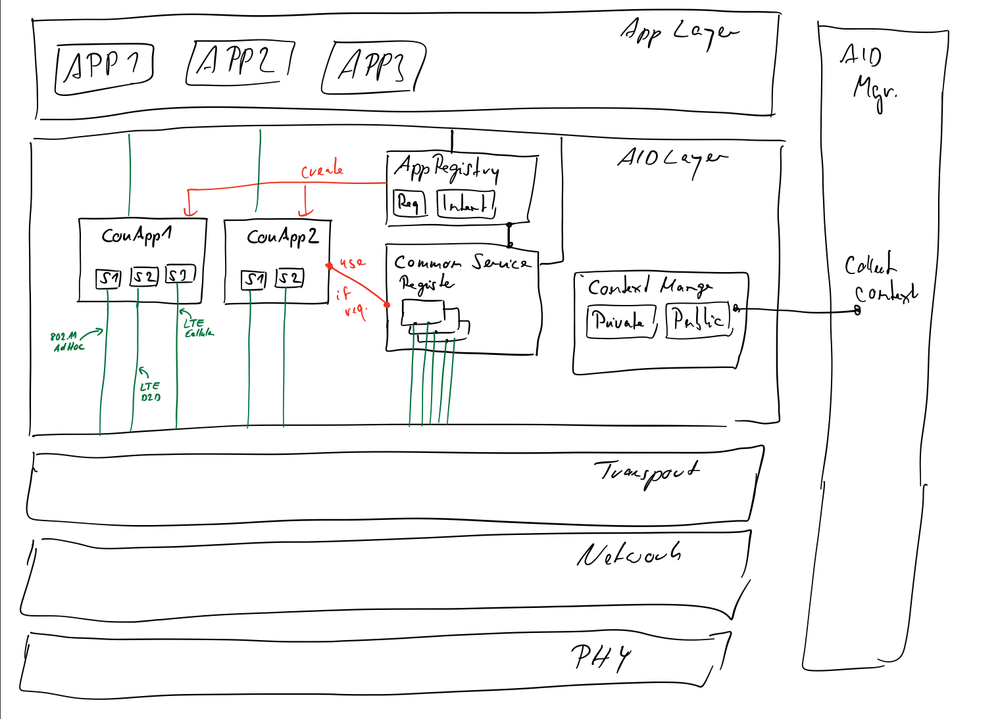

# roVer AID Service

Description of AID service (Stefan) and its usage

## Common Service Register

Contains applications or services useful for many applications. If  multiple
application need the same service each application would introduce messages
to accomplish the same outcome. If these kinds of services are provided in
a common, shared way. Unnecessary duplicate messages can be avoided.

Examples for such services are neighbourhood maps and node density maps.
A *neighbourhood map* contains information about each node which is reachable
to the current node directly (direct neighbour). From each node the current
location, speed, heading as well as some network identifier is known.
This information is highly useful to determine how likely direct communication
is possible.

The *node density map* contains data from a bigger geographical region in the vicinity
of the node. It contains however only node counts for some arbitrary sized cells and no
further identifiers of the underlying nodes. This map is then propagated (hop count > 1)
to disseminate the density measures. The density map can benefit from local information
contained in the neighbourhood map.

## Context Manager

The context manager contains static and dynamic information of the node, state
existing communication channels as well as the overall state of the accessible
medium.  This includes for instance number of network interfaces, battery
status, available applications, current location, speed, current data rate
used, channel busy ratio for each accessible medium, public advertisements of
services provided by other nodes.

This context is separated in a private and public spheres where the former is
never shared and does not leave the node. The public context can be shared
to aid the decentral information dissemination.

## Application Register

Each application must register itself to the AID service and share its
requirements and intent with the AID service.

*Requirements* are for instance minimal message rates needed for the application
logic to function properly.

*Intent*  Security, Information, Entertainment, ...

TBD: Are common services part of the requirements an application must share during
registration?

## Connection

The aid service creates *one* connection for each application. The connection is
the entry point for an application to communicate with the AID service as well as
to send and receive data. Each connection contains one or more sockets which
connect to one specific communication channel. A mode in this sense is a
technology (i.e. wireless LAN 802.11 or cellular LTE) as well as mode such as
cellular, d2d, infrastructure mode. The number of sockets depends on the
requirements of the application as well as the capabilities of the node (number
and type of network interfaces)

Each connection has a handler to access common services as well as the
context manager to use these information to decide who to handle request and
indication primitives.