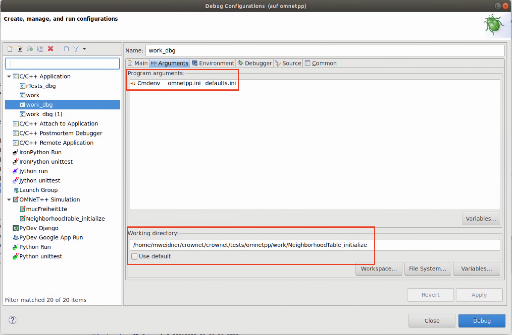

# opp_test tool

The opp_test tool is a python tool developed to test the OMNeT++ simulation kernel. It's a python script that converts a .test-file into a runnable executable. Each .test-file will be compiled into a subfolder with the same name (`sample.test` -> `sample/`)

The crownet opp_tests can be found under `crownet/crownet/tests/omnetpp`
The whole opp_test process is wrapped with a shell script called `runtest`. This script sets variables to build the executable and runs all tests.

## Debugging
1. to debug .test-files it is important to build all modules in debug mode and make changes in the `runtest`-script. To debug .test-files, the `runtest` needs to build in debug mode (`MAKE="make MODE=debug"`),  the linked libraries need to be in debug mode as well (f.e. `EXTRA_INCLUDES="$CROWNET_INCLUDE $INET_INCLUDE -lINET_dbg -lCROWNET_dbg"`)

2. execute `./runtest` (creates a c++-executable and subfolders for each .test-file)

3. to debug a specific test (`/subfolder`) the debug configuration needs to be edited (in omnetpp-ide: right-click the executeable (work_dbg) -> Debug as -> Debug Configuration):
    * at the arguments section, copy the arguments from the created file `<subfolder>/run` (f.e. `-u Cmdenv _defaults.ini` without the `export`-line and the `"$@"` at the end)
    * IMPORTANT: uncheck the checkbox `Use default` and set it to the directory of the `subfolder`



## .test-file sections
The opp_test tool generates code based on sections in the .test-file. Each section starts with an `%` and ends with the end of file or a new section. Below are some notes from us, to document some specific behavior of a section. If you want to know how to use them, please visit: https://doc.omnetpp.org/omnetpp/manual/#cha:testing
### %file
Creates a new file with the given filename in the `/subfolder`.
Although it can be any kind of file (.net, .cc, .json, ...), it is recommended to use the %inifile section for .ini-files.

### %inifile
Creates a .ini-file for the test to initialize the test simulation. This .ini-file can contain known variables like `sim-time-limit`. Be aware that the opp_test tool generates some default values and overriding these values might cause errors. 
```
[General]
network = Test
cmdenv-express-mode = false
cmdenv-log-prefix = ""
```
Its not recommended calling your network `Test`.
### %global
Used to write c++ code and make it global to the created module. Can be a function that can be run in the %activity section.
### %activity
Used to run own code. Omnet generates a new net and ini file for this module. Useful for testing single units, with less to none omnetpp dependencies. Make sure to print important logic to the stdout for validation.
### %contains %not-contains
Checks if a block of text is/is not present in the file (stdout/stderr). If one wants to test multiple lines with any amount of lines between them, multiple %contains/%not-contains are needed.
### %contains-regex %not-contains-regex
Checks if a certain regex is/is not present in a given file. Uses perl syntax for regex. (See perl cheat sheet in [useful links](#usefull-links))

# Useful links
* opp_test source file: [opp_test.py](https://github.com/omnetpp/omnetpp/blob/master/src/utils/opp_test)

* The omnetpp test docs: [omnetpp testing docs](https://doc.omnetpp.org/omnetpp/manual/#cha:testing) 

* Perl regex cheat sheet (for %contains-regex in .test-file): [cheat sheet](https://www.geeksforgeeks.org/perl-regex-cheat-sheet/)