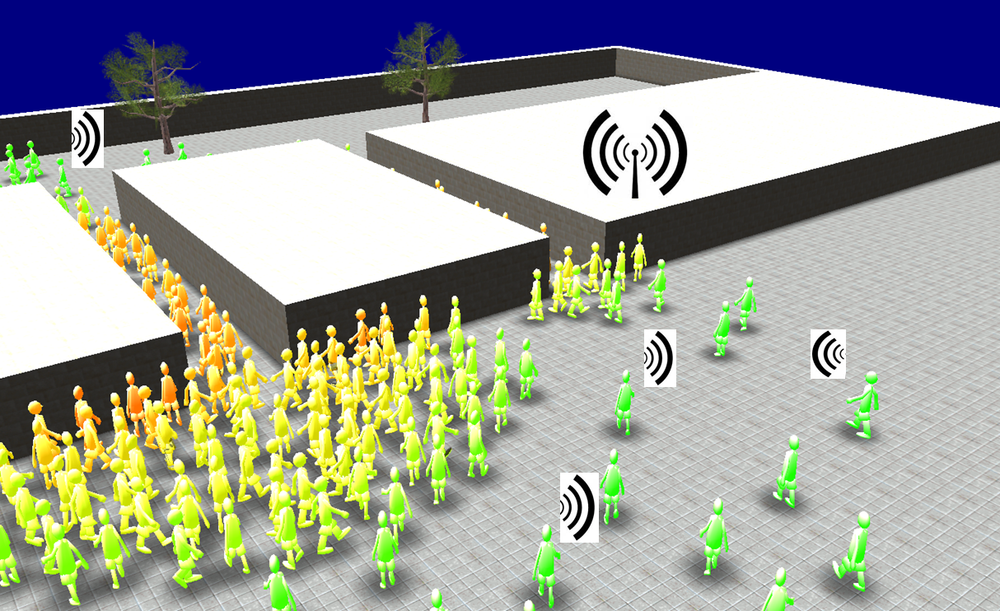
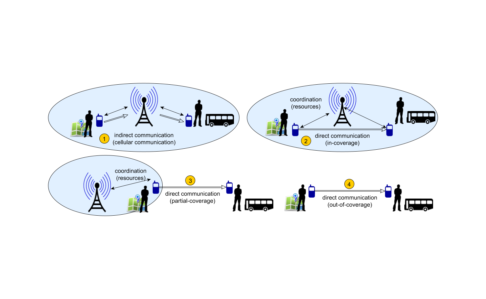

# CrowNet - **Crow**d **Net**work

A central element of intelligent transport infrastructures as well as innovative mobility concepts is networking: intelligent vehicles and traffic control systems exchange information to make traffic safer, more efficient and more environmentally friendly. New forms of communication, e.g. via smartphones, enable new mobility concepts such as car and bike sharing. Here, road users communicate with each other as well as with mobility service providers and the transport infrastructure. The information thus distributed via mobile radio thus influences the behaviour of road users. At the same time, however, user behaviour and mobility also influence the communication infrastructure - up to a complete breakdown of communication, e.g. during major events or in extreme situations, such as the Munich attack in July 2016. With the increasing spread of intelligent transport systems, these interactions between transport infrastructure, user mobility and communication infrastructure will continue to increase. However, a particularly high density of active, communicating road users often arises from pedestrians travelling in groups - e.g. after a major event - or changing modes of transport. Simulations can be used to investigate whether networking and information dissemination are robust in these mobility scenarios. Existing simulation systems mainly focus on car traffic.

## The first simulation framework to simulate interactions between pedestrians and mobile networks.

CrowNet (for crowd network) is an open-source simulation environment which couples state-of-the art pedestrian locomotion models with wireless
communication models. It can be used to evaluate pedestrian communication in urban and rural environments.

CrowNet is the only simulation framework that allows to simulate interactions of crowd motion and mobile networks. Other simulation frameworks  simulate pedestrian locomotion separately and before they simulate the communication in the network. Therefore, interactions can not be observed. Using CrowNet, interactions between locomotion and information dissemination can be investigated for the first time systematically in simulation studies.

## Research project
CrowNet has been developed as part of the [roVer](https://www.hm.edu/allgemein/forschung_entwicklung/forschungsprojekte/projektdetails/wischhof/wischhof_koester_rover.de.html) research project at [Munich University of Applied Sciences](https://www.hm.edu/en/index.en.html).
roVer is a project funded by the [Federal Ministry of Education and Research](https://www.bmbf.de/) (Grant number: 13FH669IX6).

## Contributions

We welcome contributions from anyone, who is interested in extending or improving the software framework.

###  Contact

Having trouble with CrowNet? Please feel free to contact us.
